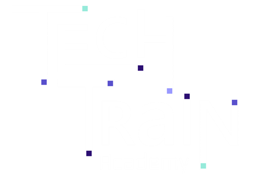

&nbsp;&nbsp;&nbsp;&nbsp;&nbsp;&nbsp;

 

# Tech Train - Hands-on Azure Development

- [Introduction](#introduction)
- [Workshops](#workshops)
- [Additional Resources](#additional-resources)
- [License](#license)

 

# Introduction 
Tech Train has arrived the station and we are excited to welcome you to the **Hands-on Azure Development** course! We hope that you will find this course informative and engaging. ☁️🚂
👨‍💻👩‍💻😊

This hands-on course is designed for developers and SREs who want to gain practical experience with various Azure, cloud services and production best practices. Over multiple in-person sessions, participants will explore essential tools, Infrastructure as Code (IaC) using Bicep, and Ev2 understanding. Additionally, participants will delve into real-world hero scenarios, covering essentials topics such as security, serverless, and event-driven solutions. By the end of the course, attendees will be equipped to apply their knowledge to create efficient, scalable, and secure solutions in the Azure ecosystem.

In this course you will solve a series of challenges that will help you gain hands-on experience, enhancing a complete ToDo application blueprint based on [azure-samples/todo-csharp-cosmos-sql](https://github.com/azure-samples/todo-csharp-cosmos-sql), that includes everything you need to build, deploy, and monitor an Azure solution.

 

# Workshops 
* Workshop 00: [Prerequisites - Ready, Set, GO!](./docs/0-prerequisites-ready-set-go.md)
* Workshop 01: [Setting up a dev environment](./docs/1-setting-up-a-dev-environment.md)
* Workshop 02: [Azd init](./docs/2-azd-init.md)
* Workshop 03: [Debug applications using VSCode and devcontainer](./docs/3-debug-applications-using-vscode-and-devcontainer.md)
* Workshop 04: [Security Principals](./docs/4-security-principals.md)
* Workshop 05: [Express V2 (Ev2)](./docs/5-ev2.md)
* Workshop 06: [Centralizing control of your APIs securely and at scale](./docs/6-centralizing-control-of-your-apis-securely-and-at-scale.md)
* Workshop 07: [Getting started with Azure Functions](./docs/7-getting-started-with-azure-functions.md)
* Workshop 08: [Use Dependency Injection in .NET Azure Functions](./docs/8-use-dependency-injection-in-dotnet-azure-functions.md)
* Workshop 09: [Real-time event streaming for IP threat detection](./docs/9-realtime-event-streaming-for-ip-threat-detection.md)
* Workshop 10: [Monitoring and scaling](./docs/10-monitoring-and-scaling.md)
* Workshop 11: [Reactive features with Change Feed and Durable Entities](./docs/11-reactive-features-with-change-feed-and-durable-entities.md)

 

# Additional Resources 
| Name | Description |
|---|---|
| [What The Hack](https://github.com/microsoft/WhatTheHack) | A collection of challenge-based hackathons focused on learning and demonstrating value of Microsoft Azure |
| [azure-samples/todo-csharp-cosmos-sql](https://github.com/azure-samples/todo-csharp-cosmos-sql) | A blueprint base template for this course to build, deploy, and monitor an Azure solution  |

 

# License 
This repository is licensed under MIT license. More info can be found [here](./LICENSE).
