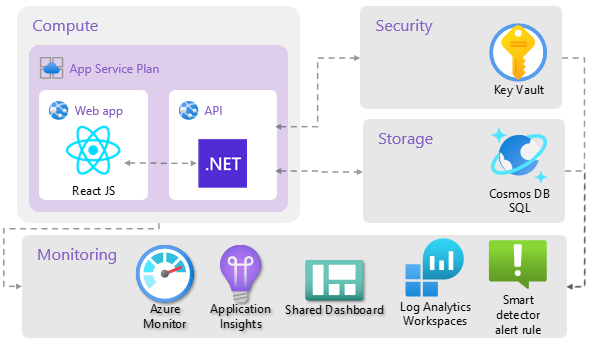
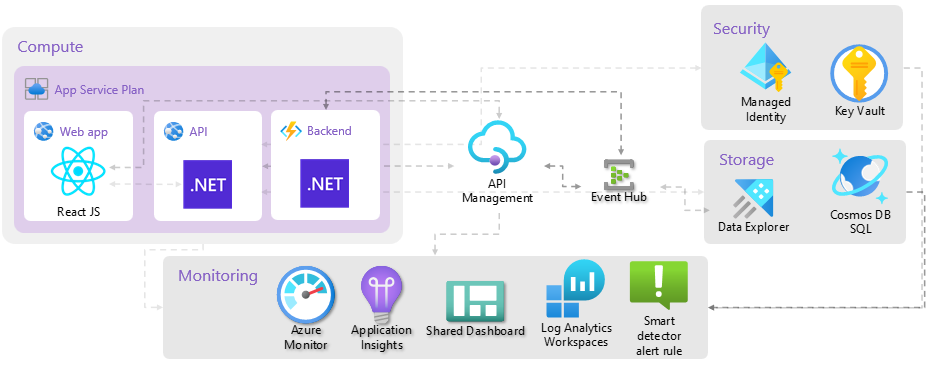

# Workshop: Prerequisites - Ready, Set, GO!

- [Prerequisites](#prerequisites)
    - [Azure Subscription](#azure-subscription)
    - [GitHub Account](#github-account) (<span style="color:green"><b>Optional</b></span>)
    - [Installations](#installations)
- [Getting familiar with the course content](#course-content)
- [Additional Resources](#additional-resources)

## Prerequisites <a name="prerequisites"></a>

### Azure Subscription <a name="azure-subscription"></a>
You will need an Azure subscription with contributor role permissions to complete this course.
* Microsoft employees can activate Azure $150 monthly credit benefit via [Visual Studio Subscriptions Portal](https://my.visualstudio.com/Benefits).
* For non Microsoft employees you can sign up for a [free Azure account here](https://azure.microsoft.com/en-us/free/), If you've never used Azure, you will get:
    * $200 free credits for use for up to 30 days
    * 12 months of popular free services (includes storage, Linux VMs)
    * Then there are services that are free up to a certain quota

    > Details can be found here on [free services](https://azure.microsoft.com/en-us/free/).

If you have used Azure before, we will still try to limit cost of services by suspending, shutting down services, or destroy services before end of the course. You will still be able to use the free services (up to their quotas) like App Service, or Functions.

### GitHub Account (<span style="color:green"><b>Optional</b></span>)<a name="github-account"></a>
With GitHub account you will be able to:
* Easily track changes and navigate revisions of your course content, as well as contribute to the course content.
* Participate in extra challenges that involve hands-on configuration of CI/CD.

If you don’t already have one, you can sign up for a free account [here](https://github.com/).

### Installations <a name="installations"></a>
* [Docker desktop](https://www.docker.com/products/docker-desktop)
* [Visual Studio Code](https://code.visualstudio.com/)
    * [Dev Containers extension](https://marketplace.visualstudio.com/items?itemName=ms-vscode-remote.remote-containers)
* [Git](https://git-scm.com/downloads)

## Getting familiar with the course content <a name="course-content"></a>
In this course, you will gain hands-on experience by solving a series of challenges that enhance a complete ToDo application blueprint based on [azure-samples/todo-csharp-cosmos-sql](https://learn.microsoft.com/en-us/azure/architecture/guide/azure-resource-manager/advanced-templates/enterprise-infrastructure-bicep-container-registry). This blueprint includes everything you need to build, deploy, and monitor an Azure solution. The initial application blueprint utilizes the following Azure resources:

The initial application blueprint utilizes the following Azure resources:
* [Azure App Service](https://learn.microsoft.com/en-us/azure/app-service/overview) to host the Web frontend and API backend
* [Azure Cosmos DB SQL API](https://learn.microsoft.com/en-us/azure/cosmos-db/nosql/) for storage
* [Azure Monitor](https://learn.microsoft.com/en-us/azure/azure-monitor/overview) for monitoring and logging
* [Azure Key Vault](https://learn.microsoft.com/en-us/azure/key-vault/general/overview) for securing secrets

Here's a high level architecture diagram that illustrates these components. Notice that these are all contained withing a single resource group, that will be created for you when you create the resources.



You will explore essential tools such as devcontainer, azd, and Bicep to author Infrastructure as Code (IaC) and Ev2 to deploy multiple environments for your solution.

Additionally, you will delve into real-world hero scenarios, covering essential topics such as security, serverless, and event-driven solutions. You will have hands-on experience by enhancing the solution with new Azure resources such as:

* [Azure Managed Identity](https://learn.microsoft.com/en-us/entra/identity/managed-identities-azure-resources/overview) for secure communication between services.
* [Azure Event Hub](https://learn.microsoft.com/en-us/azure/event-hubs/event-hubs-features) for processing large volumes of events and data
* [Azure API Management](https://learn.microsoft.com/en-us/azure/api-management/api-management-key-concepts) for centralizing control of APIs securely and at scale
* [Azure Data Explorer](https://learn.microsoft.com/en-us/azure/data-explorer/data-explorer-overview) for analyze high volumes of data in near real time.
* [Azure Functions](https://learn.microsoft.com/en-us/azure/azure-functions/functions-overview?pivots=programming-language-csharp) for running code on-demand without having to explicitly provision or manage infrastructure.

By doing so, you will be able to deploy a complete enhanced solution that is scalable, secure, and efficient and end up with an architecture diagram as below.



To get started with the course, you will need to perform the following steps:
1. Get the course content:
    1. If you have a GitHub account fork the **techtrain-handson-azure-development** repository to your GitHub account. Otherwise, you can skip this step.
        1. Navigate to the [**techtrain-handson-azure-development**](https://github.com/amih90/techtrain-handson-azure-development) repository.
        1. Click **Fork** in the upper-right corner of the page.
        1. Select your GitHub account as the destination.
        1. Clone the forked repository to your local machine.

        ```bash
        GITHUB_USER=<yourGithubUser>

        git clone https://github.com/${GITHUB_USER}/techtrain-handson-azure-development
        ```
    1. If you don’t have a GitHub account and don’t wish to create one, clone the **techtrain-handson-azure-development** repository to your local machine
        ```bash
        git clone https://github.com/amih90/techtrain-handson-azure-development
        ```
1. Open the repository in Visual Studio Code:
    ```bash
    cd techtrain-handson-azure-development

    # Open current directory in VS Code
    code .
    ```
1. Open the file explorer or press `Ctrl` + `Shift` + `E`, and get familiar with the repository layout:
    ```
        .
        ├── .azdo                        # Azure DevOps Pipelines files
        ├── .azure                       # Stores Azure configurations and environment variables
        ├── .devcontainer                # Devcontainer files
        ├── .github                      # Configures a GitHub workflow
        ├── .vscode                      # VS Code workspace configurations
        ├── assets                       # Assets used in the documentation
        ├── bin                          # Contains ev2 artifcats after build
        ├── docs                         # Documentation supplements
        ├── ev2                          # Ev2 service artifacts
        │   ├── Configurations
        |   ├── Parameters
        |   ├── RolloutSpecs
        |   ├── ScopeBindins
        |   ├── ServiceModels
        |   └── ...
        ├── infra                        # Contains infrastructure as code files
        │   ├── app
        |   ├── core                     # Contains reusable Bicep modules
        |   ├── main.bicep               # Main infrastructure file
        |   ├── main.parameters.json     # Main infrastructure parameters file
        │   └── ...
        ├── src
        │   ├── api                      # Webapp API backend service
        |   ├── backend                  # Azure Functions backend service
        |   ├── web                      # Webapp frontend service
        ├── azure.yaml                   # Describes the app and type of Azure resources
        ├── openapi.yaml                 # OpenAPI specification for the application
        └── ...
    ```
1. Open a new **bash** terminal by clicking **+˅** and select **Bash**.
1. In terminal, create a new branch where you can perform the tasks during the various workshops that will be held in the course.
    ```bash
    BRANCH_NAME=<yourAlias>

    # Switch to a new branch from the initial commit for the course
    git switch -c ${BRANCH_NAME} $(git rev-list HEAD | tail -2 | head -n 1)

    # Create your initial commit
    git commit --allow-empty -m "🚂 get on the train"
    ```


During the course, you will be asked to perform a number of [workshops](../README.md#workshops) that build on each other. If you are confused, skip something, or want to see some samples and sources, you can check the git history of the main branch, where every commit has a workshop number as a prefix. Feel free to [cherry-pick](https://git-scm.com/docs/git-cherry-pick) commits from the main branch to your branch if you need to, in order to keep up with the course.

