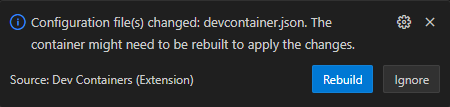
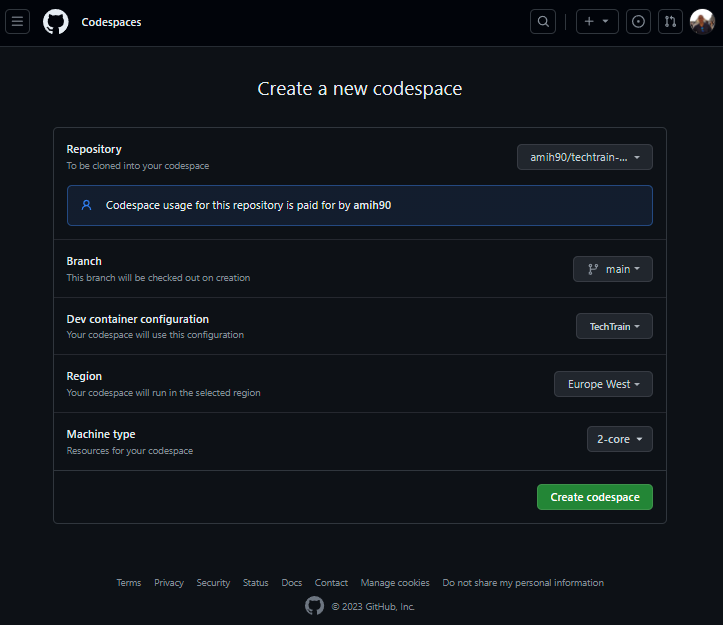

# Workshop: Setting up a dev environment

- [Introduction](#introduction)
- [Learning Objectives](#learning-objectives)
- [Challenges](#challenges)
    - [Challenge 1: Use devcontainer as a dev environment](#challenge-1)
    - [Challenge 2 (<b>Optional</b>): Use Github Codepsaces as a dev environment](#challenge-2)
- [Additional Resources](#additional-resources)

## Introduction 
A development container is a lightweight, portable, and reproducible environment that encapsulates your entire development stack. Imagine having a consistent environment across various stages of your project, ensuring that every team member, regardless of their local setup, experiences the same development environment. Dev containers leverage tools like Docker to encapsulate dependencies, libraries, and configurations, enabling seamless collaboration and eliminating the classic "it works on my machine" scenario. This modern approach empowers developers to spin up a containerized environment effortlessly, reducing setup time and fostering consistency, making your development journey smoother and more collaborative.

Dev containers can be used for a wide range of scenarios, such as web development, data science, machine learning, and more. You can use dev containers to create and run applications using your favorite languages, frameworks, and tools, without worrying about compatibility issues or installation errors. You can also use dev containers to connect to remote services and resources, such as databases, APIs, or cloud services, and access them securely from your local environment.

There are many tools and platforms that support dev containers, such as Visual Studio Code, GitHub Codespaces, and more. These tools and platforms make it easy to create, share, and manage dev containers, and provide features such as code editing, debugging, testing, version control, and collaboration. You can also customize your dev containers to suit your specific needs and preferences, and reuse them across different projects and teams.

## Learning Objectives 
1. Understanding, customizing and extending dev containers.
1. Leveraging a dev container to debug your application.

## Challenges 
1. Use devcontainer as a development environment.
1. Debug an application inside a local devcontainer.
1. Use Github Codepsaces as a dev environment.

### Challenge 1: Use devcontainer as a dev environment 
The Visual Studio Code Dev Containers extension allows you to use a container as a full-featured development environment. You can open any folder inside (or mounted into) a container and take advantage of Visual Studio Code’s full feature set. A devcontainer.json file in your project tells VS Code how to access (or create) a development container with a well-defined tool and runtime stack. This container can be used to run an application or to separate tools, libraries, or runtimes needed for working with a codebase.

Workspace files are mounted from the local file system or copied or cloned into the container. Extensions are installed and run inside the container, where they have full access to the tools, platform, and file system. This means that you can seamlessly switch your entire development environment just by connecting to a different container.

Let’s customize our dev container to include a local-quality development experience that includes full IntelliSense (completions), code navigation, and debugging capabilities for all features we would use in the course.

1. Open **.devcontainer/devcontainer.json** file.
1. Update the name of your devcontainer, for example **TechTrain**.
1. Update Node version to **18**.
1. Add the following features to the **features** object:
    | Name | Description | JSON |
    |---|---|---|
    | Azure CLI | Will be used to authenticate with Azure when resources are running locally | `"ghcr.io/devcontainers/features/azure-cli:1": { "version": "latest" }` |
    | Azure Functions Core Tools | Will be used to run Azure Functions locally | `"ghcr.io/jlaundry/devcontainer-features/azure-functions-core-tools:1": { "version": "latest" }` |

    > **Features** - are self-contained units of installation code and development container configuration. Features are designed to install atop a wide-range of base container images. More information and available features in can be found in [Development Container Features](https://github.com/devcontainers/features).

1. Add the following VSCode extensions to **customizations.vscode.extensions** array:

    | Name | Description | Identifier |
    |---|---|---|
    | Azurite | An open source Azure Storage API compatible server | `azurite.azurite` |
    | Official C# extension from Microsoft | Official C# extension from Microsoft | `ms-dotnettools.csdevkit` |
    | ARM Template Viewer | Graphically display ARM templates in an interactive map view | `bencoleman.armview` |
    | Durable Functions Monitor | Monitoring/debugging UI tool for Azure Durable Functions | `durablefunctionsmonitor.durablefunctionsmonitor` |
    | Git Graph | View a Git Graph of your repository, and perform Git actions from the graph. | `mhutchie.git-graph` |

    > **VSCode extensions** - are the primary way to add new functionality to VSCode. They are built with the same APIs used by VSCode and can be installed from the [Visual Studio Code Marketplace](https://marketplace.visualstudio.com/vscode). You can browse and install extensions from within VSCode by clicking on the Extensions icon in the activity bar on the side of VSCode or via **View -> Extensions** command.

1. Apply your changes using one of the following approaches:
    1. VSCode will detect changes in the devcontainer configurations and will suggest to **Rebuild** inside a popup.
        
    1. Using the Dev Container extension shortcut on the bottom left corner of the VSCode window.
        1. Press the **><** icon.
        1. Select **Rebuild Container**.
    1. Using the [Command Palette](https://code.visualstudio.com/docs/getstarted/userinterface#_command-palette) by running `Ctrl` + `Shift` + `P` and selecting **Dev Containers: Rebuild Container**.
1. After the container will be rebuilt, all the capabilities and extensions you configured are available in your devcontainer.
    > You can validate it by opening the terminal and running `az --version`, command to view the version of Azure CLI tool you just added.
1. <b>Optional</b> - Customize your devcontainer by adding an interesting and useful VSCode extension:
    1. Go to [Visual Studio Marketplace](https://marketplace.visualstudio.com/vscode) and search for an extension.
    1. Add the extension to **customizations.vscode.extensions** array.
    1. Rebuild your devcontainer.
    1. Validate the extension is available in your devcontainer.

### Challenge 2 (<b>Optional</b>): Use Github Codepsaces as a dev environment 
GitHub Codespaces is a cloud-based development environment that allows you to create and customize a full-featured development environment in the cloud. You can use it to work on any project on GitHub, pre-installing dependencies, libraries, and even Visual Studio Code extensions and settings. With Codespaces, you can spin up fully configured dev environments in the cloud from any GitHub repository in seconds. You can customize your coding experience, control your dotfiles, run Jupyter notebooks, and collaborate with your team in Codespaces. Codespaces provides cloud-powered development environments for any activity - whether it's a long-term project, or a short-term task like reviewing a pull request. You can work with these environments from Visual Studio Code or in a browser-based editor

For experiencing the power of Github Codespaces:
1. Click 
1. Select the desired **Dev container configuration** if there are more than one devcontainer configuration available.
1. Select **Region** where your Codespace will be hosted, and a **Machine type** (You can have a very powerful machine, but pick the smallest size for this course).
1. Click **Create Codespace**, after few minutes you will have a fully functional dev environment on the cloud.
    
1. Validate you have a fully functional dev environment on the cloud for maximize your productivity.
1. Delete the Codespace once you are done, to avoid unnecessary charges.
    1. Find the codespace in the [Codespaces dashboard](https://github.com/codespaces).
    1. Click the **...** icon, and then click **Delete**.

## Additional Resources 
| Name | Description |
| --- | --- |
| [Extensions for Visual Studio Code](https://marketplace.visualstudio.com/vscode) | VSCode extensions marketplace |
| [Visual Studio Code User Interface](https://code.visualstudio.com/docs/getstarted/userinterface) | VSCode user interface documentation |
| [GithHub Codespaces](https://docs.github.com/en/codespaces) | GitHub Codespaces documentation |