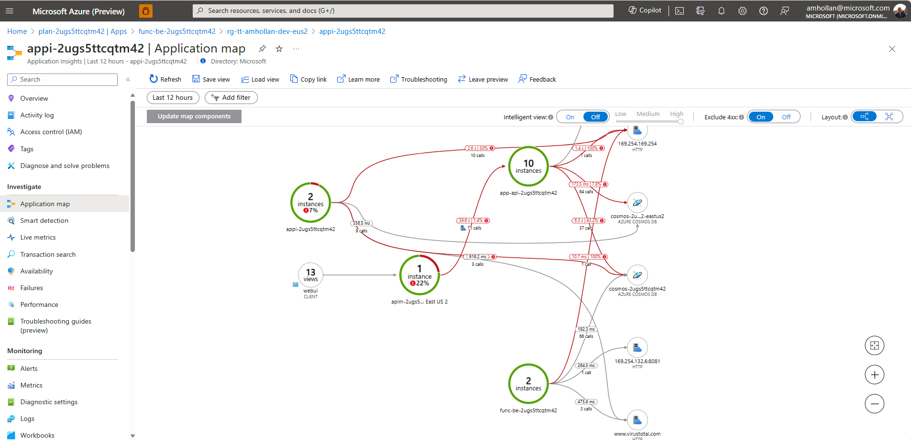
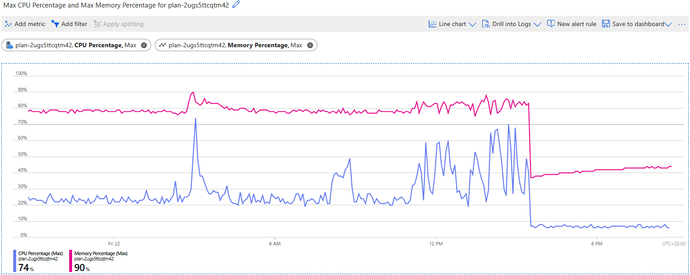
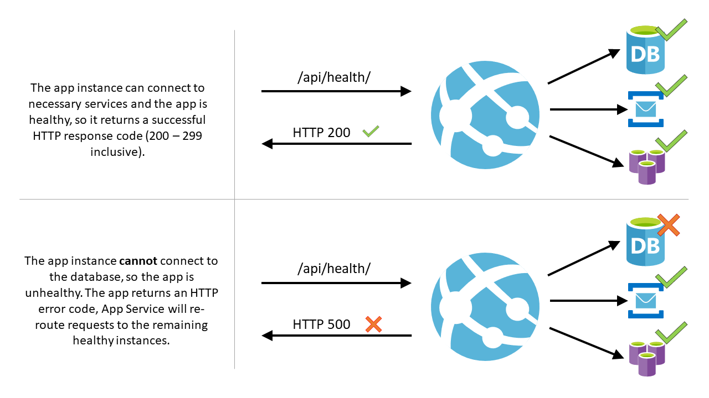
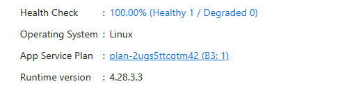

# Workshop: Monitoring and scaling

- [Introduction](#introduction)
- [Learning Objectives](#learning-objectives)
- [Challenges](#challenges)
    - [Challenge 1: Expose Healthz endpoint in a web server](#challenge-1)
    - [Challenge 2: Configure health check probe for App Service instance](#challenge-2)
- [Additional Resources](#additional-resources)


## Introduction <a name="introduction"></a>
Your ToDo application is deployed, real-time event streaming is happenning, and all good! or not. Customers started to complains about latency and downtime... It’s time to monitor and scale your application!

Overtime you might suffer from performance issues when the application is under load or when you add more and more features. Current implementation uses same compute (App Service Plan) for three different applications (Web, API, Backend), Cosmos DB, Storage, APIM, and more resources, maybe you are lack of resources, maybe we need to scale.

When you start to investigate the application using **Application map** in Application Insights, you can see that the system suffers and we need to figure out what's going on.



To understand the root cause of the problem, you can use **Failures** and **Operations** views in Application Insights and confirm the issue is related to all applications, which hints that maybe the compute resource is the bottleneck.


## Learning Objectives <a name="learning-objectives"></a>
1. Monitor and troubleshoot your application using Azure Monitor and Application Insights.
1. Scale your application to meet the demand.


## Challenges <a name="challenges"></a>
1. Scale App Service Plan.
1. Configure health check probe for App Service instance.
1. Use health checks for dependencies in your application.

### Challenge 1: Scale App Service Plan <a name="challenge-1"></a>
1. Open **main.bicep** file and locate appServicePlan resource.
1. Change the **sku** name property from **B1** to **B3**. B3 is a higher tier that will provide more compute resources X4 vCPU and ~X6 Memory (GB) for the applications.
1. Provision changes using `azd provision` command:
      ```azdeveloper
      azd provision
      ```
1. Validate we mitigated the issue by checking the **Application map** and **Failures** views in Application Insights, where we expect to see no more downtime and failures on requests.



### Challenge 2: Configure health check probe for App Service instance <a name="challenge-2"></a>
Since we had no indication about the healthiness of our applications, we were emberresed when our customers started to complain. We need to avoid such cases in the future, and make sure we get an alert when something is wrong with our application.
Health check increases your application's availability by rerouting requests away from unhealthy instances and replacing instances if they remain unhealthy. It does that by pinging every minute a path of your web application of your choice.



We can configure a health check probe for our application, and configure an alert to notify us when the application is unhealthy.
1. Open **backend.bicep** file and add `healthCheckPath: '/api/healthz'` to the function app resource. This will leverage App Service Plan health check probe to check the health of our application in intervals by calling to the `/api/healthz` endpoint and expecting to get 200 OK response.
   ```bicep
   module backend '../core/host/functions.bicep' = {
      name: '${serviceName}-functions-dotnet-module'
      dependsOn: [
         storage
      ]
      params: {
         name: name
         location: location
         tags: union(tags, { 'azd-service-name': serviceName })
         allowedOrigins: allowedOrigins
         alwaysOn: true
         appSettings: appSettings
         applicationInsightsName: applicationInsightsName
         appServicePlanId: appServicePlanId
         keyVaultName: keyVaultName
         runtimeName: 'dotnet'
         runtimeVersion: '6.0'
         storageAccountName: storage.outputs.name
         scmDoBuildDuringDeployment: false
         healthCheckPath: '/api/healthz'
      }
   }
   ```
1. Provision changes using `azd provision` command:
      ```azdeveloper
      azd provision
      ```
1. Go to the function app resource in the Azure Portal and validate function is healthy:



### Challenge 3 (<span style="color:green"><b>Optional</b></span>): Use health checks for dependencies in your application <a name="challenge-3"></a>
Azure Function Health is small library based on the aspnetcore HealthChecks feature. The traditional health checks registered in an aspnetcore API included the HealthCheckPublisherHostedService as a HostedService which is not possible or desired to run in an Azure Function. However there are benefits to included a health check in an Azure Function to test the depencies of your service. This library will allow you to register health checks for your dependencies and create an HTTP endpoint that can be used to monitor the health of your application.

There are a number of health checks that you can add to your Function App that have already been implemented. You can add any of the healthcheck defined [here](https://github.com/Xabaril/AspNetCore.Diagnostics.HealthChecks).

1. Add Microsoft.Extensions.Diagnostics.HealthCheck nuget package.
```bash
dotnet add package Microsoft.Extensions.Diagnostics.HealthChecks --version 6.0.25
```
1. In your **Startup.cs** class register your health checks
   ```csharp
      builder.Services
         .AddHealthChecks()
         .AddAzureCosmosDB();
   ```


# Additional resource
| Name | Description |
| --- | --- |
| Monitor App Service instances using Health check | https://learn.microsoft.com/en-us/azure/app-service/monitor-instances-health-check?tabs=dotnet |