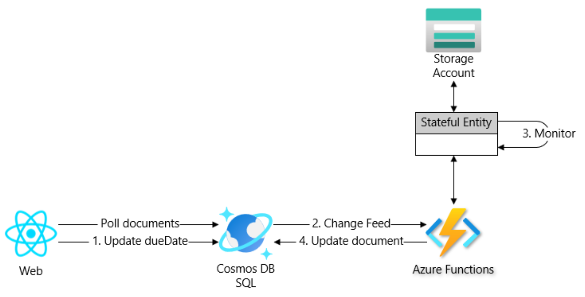
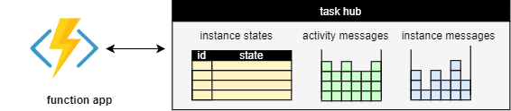
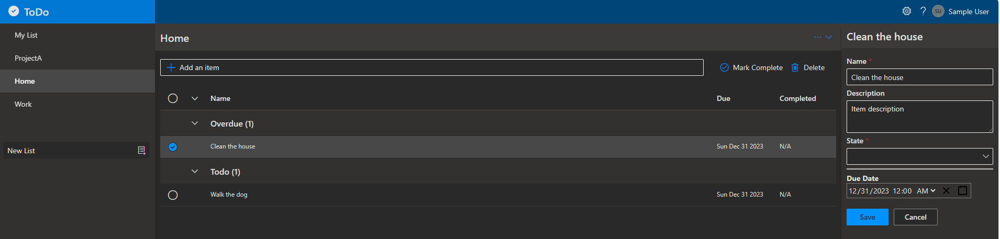
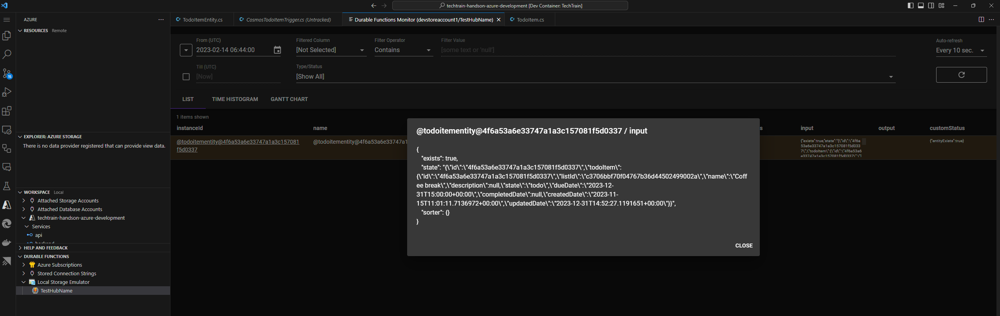

# Workshop: Reactive features with Change Feed and Durable Entities

- [Introduction](#introduction)
- [Learning Objectives](#learning-objectives)
- [Challenges](#challenges)
    - [Challenge 1: Update the Web application to support ToDo items overdue status](#challenge-1)
    - [Challenge 2: Deploy requirements for event-based architectures with Azure Cosmos DB and Azure Functions](#challenge-2)
    - [Challenge 3: Respond to changes in TodoItem container using Azure Functions](#challenge-3)
    - [Challenge 4: Monitor and update the status of ToDo items using Durable Entities](#challenge-4)
- [Additional Resources](#additional-resources)


## Introduction <a name="introduction"></a>
Your ToDo application is already up and running, monitored, secured. It’s time to enhance it with additional features! At present, the application supports creating, reading, updating, and deleting ToDo items. However, assigning a **dueDate** to an item doesn’t affect the application. This workshop will guide you on how to utilize Azure Cosmos DB Change Feed and Durable Entities to orchestrate monitors and modify the status of ToDo items.



Change Feed is an Azure Cosmos DB feature that enables you to monitor changes made to items in a container and receive a sorted list of modified documents in the order they were altered. You can employ cosmos change feed to asynchronously and incrementally process changes and distribute them among multiple consumers for parallel processing. Cosmos change feed is versatile and can be used in a variety of scenarios, such as data replication, caching, analytics, or notifications.

Azure Functions offer an easiest way to connect to the change feed. You can develop small reactive Azure Functions that will automatically trigger with each new event in your Azure Cosmos DB container's change feed. The Azure Functions trigger for Azure Cosmos DB allows you to take advantage of the Change Feed Processor’s scaling and reliable event detection features without the need to manage any worker infrastructure. You can also combine the trigger with any other Azure Functions bindings.

When using Azure Functions, you can take advantage of the extension for Durable Functions. Durable Functions is an Azure Functions extension that enables you to write stateful functions in a serverless computing environment. The extension handles state, checkpoints, and restarts for you. Durable Functions are designed to build stateful serverless applications, allowing you to write code that orchestrates workflows and tasks across multiple functions and services.

Durable Entities, also known as Stateful Entities, are a unique type of Durable Function that allows you to implement stateful objects in a serverless environment. They simplify the process of adding stateful components to your app without the need to manually persist data to external storage, allowing you to concentrate on your business logic.

Durable entities offer several benefits:
- They provide a straightforward and intuitive way to model and manipulate state as classes and methods, or as functions and messages.
- They enable efficient and scalable processing of large datasets with a high volume of writes by distributing the work across many entities, each with a modestly sized state.
- They offer reliable and durable state management by automatically persisting the state of each entity to Azure Storage and ensuring that all operations on a single entity are executed serially and in order.
- They support various scenarios, such as event computing, real-time stream processing, data movement, event sourcing, and more, by allowing entities to communicate with other entities, orchestrations, and clients using messages that are implicitly sent via reliable queues.

Combining multiple Durable Functions application patterns can yield minimal and elegant solutions to complex problems. Let’s attempt to implement the feature of updating the status of a ToDo item using the aggregator and monitor patterns.


To assist you with this workshop, we have provided you with the following supporting files:
- **Host.json** - Updated with a Task Hub:
    ```json
        "extensions": {
            "durableTask": {
                "hubName": "Todo"
            }
        }
    ```

    A task hub in Durable Functions is a representation of the current state of the application in storage, including all the pending work. While a function app is running, the progress of orchestration, activity, and entity functions is continually stored in the task hub. This ensures that the application can resume processing where it left off, should it require to be restarted after being temporarily stopped or interrupted for some reason. Also, it allows the function app to scale the compute workers dynamically.

    


- **Todo.Backend.csproj** - Updated with the following NuGet dependencies:
    | Package | Description | Notes |
    |---|---|---|
    | Microsoft.Azure.WebJobs.Extensions.DurableTask | This package provides the extension for Durable Functions. | |
    | Microsoft.Azure.Cosmos | This package provides the Azure Cosmos DB SDK for .NET. | Used with the Durable Entity to access Cosmos DB documents |

- **Startup.cs** - Configured **CosmosClient** dependency to authenticate with Managed Identity.

- **src/backend/Entities/*.cs** - Durable Entities for TodoItem.

Please cherry-pick or checkout the "🧙 supporting files" commit to your local branch.

## Learning Objectives <a name="learning-objectives"></a>
1. Respond to changes in Azure Cosmos DB using Azure Functions.
1. Developing stateful and long running tasks using Durable Functions.


## Challenges <a name="challenges"></a>
1. Update the Web application to support ToDo items overdue status.
1. Deploy requirements for event-based architectures with Azure Cosmos DB and Azure Functionsץ
1. Respond to changes in TodoItem container using Azure Functions.
1. Monitor and update the status of ToDo items using Durable Entities.

### Challenge 1: Update the Web application to support ToDo items overdue status <a name="challenge-1"></a>
Update the Web application to support TodoItemState.Overdue status and a new section in the ToDo list panel.
1. Update React Web application.
1. Deploy the Web application to Azure using `azd deploy` command:
    ```azdeveloper
    azd deploy web
    ```



### Challenge 2: Deploy requirements for event-based architectures with Azure Cosmos DB and Azure Functions <a name="challenge-2"></a>
To implement a serverless event-based flow with Cosmos DB and Azure Functions, you need:
- **The monitored container**: The monitored container is the Azure Cosmos DB container being monitored, and it stores the data from which the change feed is generated. Any inserts, updates to the monitored container are reflected in the change feed of the container.
- **The lease container**: The lease container maintains state across multiple and dynamic serverless Azure Function instances and enables dynamic scaling. You can create the lease container automatically with the Azure Functions trigger for Azure Cosmos DB. You can also create the lease container manually. To automatically create the lease container, set the CreateLeaseContainerIfNotExists flag in the configuration. Partitioned lease containers are required to have a **/id** partition key definition.

We would like to respond to changes in an existing container **TodoItem**, so we just need to create a new **Leases** container with the required partitionKey.
1. Open **db.bicep** file and and a new Leases container with the required partitionKey:
    ```bicep
    {
        name: 'Leases'
        id: 'Leases'
        partitionKey: '/id'
    }
    ```
1. Provision new container resource using `azd provision` command:
    ```bash
    azd provision
    ```

### Challenge 3: Respond to changes in TodoItem container using Azure Functions <a name="challenge-3"></a>

1. Create a new CosmosTrigger named CosmosTodoItemTrigger that will be triggered by Cosmos Db Change Feed.
    ```bash
    func new --template "Cosmos DB trigger" --name "CosmosTodoItemTrigger"
    ```
1. For every document in the change feed update the status of the task if due date is passed.
```csharp
[FunctionName("CosmosTodoItemTrigger")]
public async Task Run(
    [CosmosDBTrigger(
        databaseName: "%CosmosDatabaseName%",
        containerName: "TodoItem",
        Connection = "CosmosConnectionOptions",
        LeaseContainerName  = "Leases",
        StartFromBeginning = true,
        CreateLeaseContainerIfNotExists = false)] IReadOnlyList<TodoItem> input,
    [CosmosDB(
        databaseName: "%CosmosDatabaseName%",
        containerName: "TodoItem",
        Connection = "CosmosConnectionOptions")]
        IAsyncCollector<TodoItem> output)
{
    if (input != null && input.Count > 0)
    {
        foreach (var item in input)
        {
            bool updated = await UpdateDbState(output, item);
        }
    }
}

private async Task<bool> UpdateDbState(IAsyncCollector<TodoItem> output, TodoItem item)
{
    if (item.State != TodoItemState.Overdue && item.IsOverdue())
    {
        item.State = TodoItemState.Overdue;
        item.UpdatedDate = DateTimeOffset.UtcNow.DateTime;
        await output.AddAsync(item);

        return true;
    }

    return false;
}

```
1. Validate new functionality by creating a new ToDo item or updating an existing one with dueDate in the past and verify that the status of the item was updated to Overdue.


### Challenge 4: Monitor and update the status of ToDo items using Durable Entities <a name="challenge-4"></a>
In case an item is created and has dueDate configured to the future, we would like to create a new timer that will sync the status of the item when the dueDate is passed. We will use Aggregator (Stateful objects) and Monitor application patterns offered by Durable Functions extension.

1. Inject DurableClient to **CosmosTodoItemTrigger** function:
    ```csharp
    [DurableClient] IDurableEntityClient durableEntityClient
    ```
1. For every created or updated TodoItem triggered create an Durable Entity if needed:
    ```csharp
    if (item.DueDate is null || item.IsOverdue())
    {
        await durableEntityClient.SignalEntityAsync<ITodoItemEntity>(item.Id, proxy => proxy.Delete());
        return;
    }

    await durableEntityClient.SignalEntityAsync<ITodoItemEntity>(item.Id, proxy => proxy.Create(item));
    ```
1. Validate new functionality by creating a new ToDo item or updating an existing one with dueDate in the future and verify that a new Durable Entity was created in the storage. You can use [Durable Functions Monitor](https://marketplace.visualstudio.com/items?itemName=DurableFunctionsMonitor.durablefunctionsmonitor) VS Code extension to view the state of the Durable Entity.

    

# Additional resource
| Name | Description |
| --- | --- |
| [Building Event-driven Microservices with the Azure Cosmos DB Change Feed](https://app.pluralsight.com/library/courses/building-event-driven-microservices-azure-cosmos-db-change-feed/table-of-contents)  | Pluralsight recommended course |
| [Monitor the health of App Service instances - Azure App Service](https://learn.microsoft.com/en-us/azure/azure-functions/durable/durable-functions-create-first-csharp?pivots=code-editor-vscode) | Create a new durable functions tutorial |