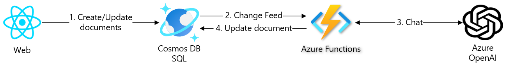
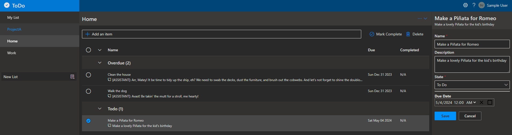
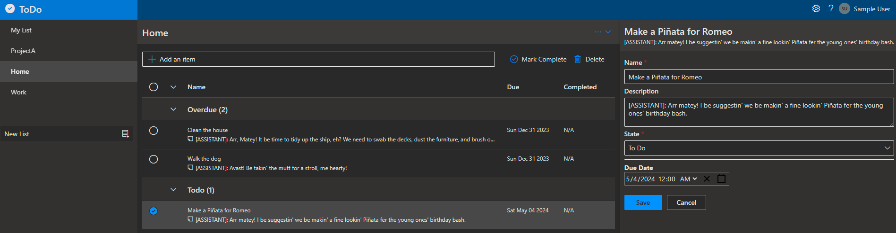

# Workshop: AI! AI AI! with Azure OpenAI!

- [Introduction](#introduction)
- [Learning Objectives](#learning-objectives)
- [Challenges](#challenges)
    - [Challenge 1: Deploy Azure Cognitive Services - Azure OpenAI using Bicep](#challenge-1)
    - [Challenge 2: Generate TodoItems descriptions using Azure OpenAI](#challenge-2)
- [Additional Resources](#additional-resources)


## Introduction <a name="introduction"></a>
Azure OpenAI Service is a product offered by Microsoft Azure that provides industry-leading coding and language AI models. These models can be fine-tuned to your specific needs for a variety of use cases. The service runs on the Azure global infrastructure to meet your production needs, such as critical enterprise security, compliance, and regional availability. It allows you to make your deployment more secure and trusted with role-based authentication and private network connectivity. You can train your AI model with full control of your data. Azure OpenAI Service is part of Microsoft’s collaboration with OpenAI, with Azure being the primary cloud platform that OpenAI uses for deep learning and AI.

Let’s piratize the TodoItems’ descriptions to give our application some personality 🏴‍☠⚔️ ⚓.



For every item if description is empty or boring, piratize it! For example, the following item "Make a Piñata for Romeo" will be piratize by Azure OpenAI and description will be updated via Cosmos DB Change Feed.


You should end with Piratized and playful description. For example, "[ASSISTANT]: Arr matey! I be suggestin' we be makin' a fine lookin' Piñata fer the young ones' birthday bash."


## Learning Objectives <a name="learning-objectives"></a>
1. Becoming familiar with Generative AI.
1. Engaging in more hands-on practice.

## Challenges <a name="challenges"></a>
1. Deploy Azure Cognitive Services - Azure OpenAI using Bicep.
1. Generate descriptions for TodoItems using Azure OpenAI.

### Challenge 1: Deploy Azure Cognitive Services - Azure OpenAI using Bicep <a name="challenge-1"></a>
1. Update **./core/ai/cognitiveservices.bicep**:
    1. Persist the Cognitive Service account key in Azure Key Vault. The account key is required for authenticate with Azure OpenAI.
        ```bicep
        param keyVaultName string

        resource keyVault 'Microsoft.KeyVault/vaults@2022-07-01' existing = {
            name: keyVaultName
        }

        resource cosmosConnectionString 'Microsoft.KeyVault/vaults/secrets@2022-07-01' = {
            parent: keyVault
            name: 'AZURE-OPEN-AI-KEY'
            properties: {
                value: account.listKeys().key1
            }
        }
        ```

    1. Update **Microsoft.CognitiveServices/accounts** resource to support Identity property and create a role assignment with **Cognitive Services OpenAI User** role definition.

        ```bicep
        param principalId string = ''

        module openAiRoleUser '../core/security/role.bicep' = if (principalId != '') {
            name: 'oai-backend-openai-user-access'
            scope: rg
            params: {
                principalType: 'ServicePrincipal'
                principalId: principalId
                roleDefinitionId: '5e0bd9bd-7b93-4f28-af87-19fc36ad61bd' // Cognitive Services OpenAI User
            }
        }
        ```

1. Reuse **./core/ai/cognitiveservices.bicep** Bicep module to add an Azure Cognitive service with OpenAI GPT model.
    ```bicep
    module openAi './core/ai/cognitiveservices.bicep' = {
        name: 'cs-oai-deployment'
        scope: rg
        params: {
            name: '${abbrs.cognitiveServicesAccounts}${resourceToken}'
            location: location
            deployments: [
                {
                    name: 'gpt-35-turbo-16k'
                    model: {
                        format: 'OpenAI'
                        name: 'gpt-35-turbo-16k'
                        version: '0613'
                    }
                    sku: {
                        name: 'Standard'
                        capacity: 120
                    }
                }
            ]
            identity: {
                type: 'UserAssigned'
                userAssignedIdentities: {
                    '${userManagedIdentity.outputs.resourceId}': {}
                }
            }
            principalId: userManagedIdentity.outputs.properties.principalId
            keyVaultName: keyVault.outputs.name
        }
    }
    ```
1. Update the functionapp backend resource AppSettings in **local.settings.json** and **main.bicep** with the Azure OpenAI endpoint:
    ```bicep
    AzureOpenAIEndpoint: openAi.outputs.endpoint
    ```
1. Run the `azd provision` command for provision the cloud resources:

    ```azdeveloper
    azd provision
    ```

    After provisioning the resources, you can find the **Azure OpenAI** resource in the Azure Portal.

### Challenge 2: Generate descriptions for TodoItems using Azure OpenAI <a name="challenge-2"></a>

1. Add **Azure.AI.OpenAI** NuGet package, the Azure OpenAI client library for .NET is an adaptation of OpenAI's REST APIs that provides an idiomatic interface and rich integration with the rest of the Azure SDK ecosystem..
    ```bash
    dotnet add package Azure.AI.OpenAI --prerelease
    ```
1. Open **Startup.cs** and initialize an OpenAIClient singleton:
    ```csharp
    .AddSingleton<OpenAIClient>(serviceProvider =>
        {
            var azureOpenAIEndpoint = Environment.GetEnvironmentVariable("AzureOpenAIEndpoint");
            Uri azureOpenAIResourceUri = new(azureOpenAIEndpoint);

            var keyVaultUri = new Uri(Environment.GetEnvironmentVariable("KeyVaultEndpoint"));
            var httpClient = serviceProvider.GetService<HttpClient>();
            var defaultAzureCredentials = serviceProvider.GetService<DefaultAzureCredential>();

            // Retrieve key from KeyVault
            var secretClient = new SecretClient(keyVaultUri, defaultAzureCredentials);
            var azureResponseKeyVaultSecret = new Lazy<Task<Azure.Response<KeyVaultSecret>>>(async () => await secretClient.GetSecretAsync("AZURE-OPEN-AI-KEY"));
            var openAIApiKey = azureResponseKeyVaultSecret.Value.Result.Value.Value;

            AzureKeyCredential azureOpenAIApiKey = new(openAIApiKey);

            return new OpenAIClient(azureOpenAIResourceUri, azureOpenAIApiKey);
        })
    ```
1. Create a new CosmosTrigger and named it **CosmosTodoItemAITrigger**. Similar to **CosmosTodoItemTrigger**, listen the TodoItem container and for each document "piratize" the description of each TodoItem. Provide **LeaseContainerPrefix** to the CosmosTrigger to be able to listen to the Cosmos DB container Change Feed from multiple functions.

    ```csharp
    [CosmosDBTrigger(
        databaseName: "%CosmosDatabaseName%",
        containerName: "TodoItem",
        Connection = "CosmosConnectionOptions",
        LeaseContainerName  = "Leases",
        LeaseContainerPrefix = "ai",
        CreateLeaseContainerIfNotExists = false)] IReadOnlyList<TodoItem> input,

    ...

     private async Task<bool> Piratize(IAsyncCollector<TodoItem> output, TodoItem item)
    {
        // Stopping condition
        if (!string.IsNullOrWhiteSpace(item.Description) && item.Description.StartsWith("[ASSISTANT]"))
        {
            return false;
        }

        var input = string.IsNullOrWhiteSpace(item.Description) ? item.Name : item.Description;

        var chatCompletionsOptions = new ChatCompletionsOptions()
        {
            DeploymentName = "gpt-35-turbo-16k",
            Messages =
            {
                new ChatRequestSystemMessage("You are a helpful assistant. You will talk like a pirate. Rephrase, correct the grammar, and formulate a to-do task."),

                new ChatRequestUserMessage(input),
            }
        };

        Response<ChatCompletions> response = await _openAIClient.GetChatCompletionsAsync(chatCompletionsOptions);
        ChatResponseMessage responseMessage = response.Value.Choices[0].Message;

        // Add a prefix to the description to indicate the stopping condition for infinite updates.
        item.Description = $"[ASSISTANT]: {responseMessage.Content}";

        return true;
    }
    ```
1. Deploy the Backend application to Azure using `azd deploy` command:
    ```azdeveloper
    azd deploy backend
    ```

    After the deployment, validate new function is in place via the Function App resource in Azure Portal.


# Additional resource
| Name | Description |
| --- | --- |
| [Azure OpenAI client library for .NET](https://learn.microsoft.com/en-us/dotnet/api/overview/azure/ai.openai-readme?view=azure-dotnet-preview)  | |
