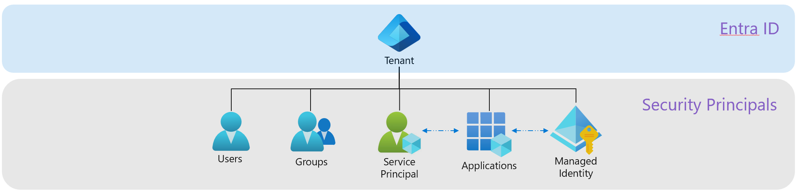
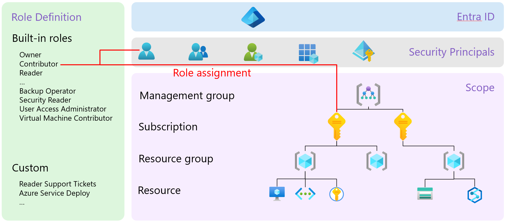
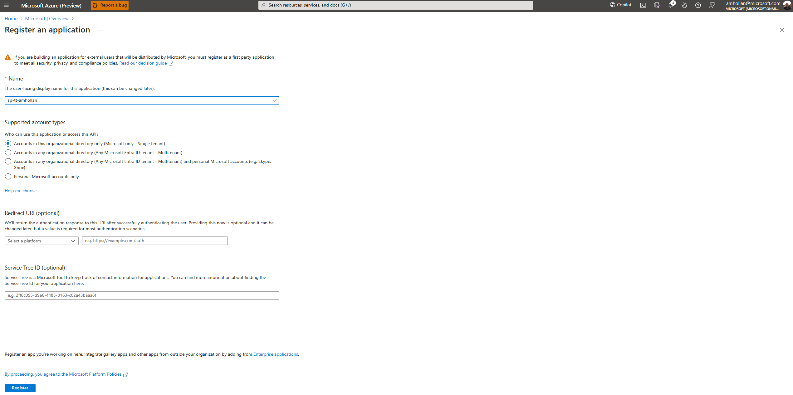
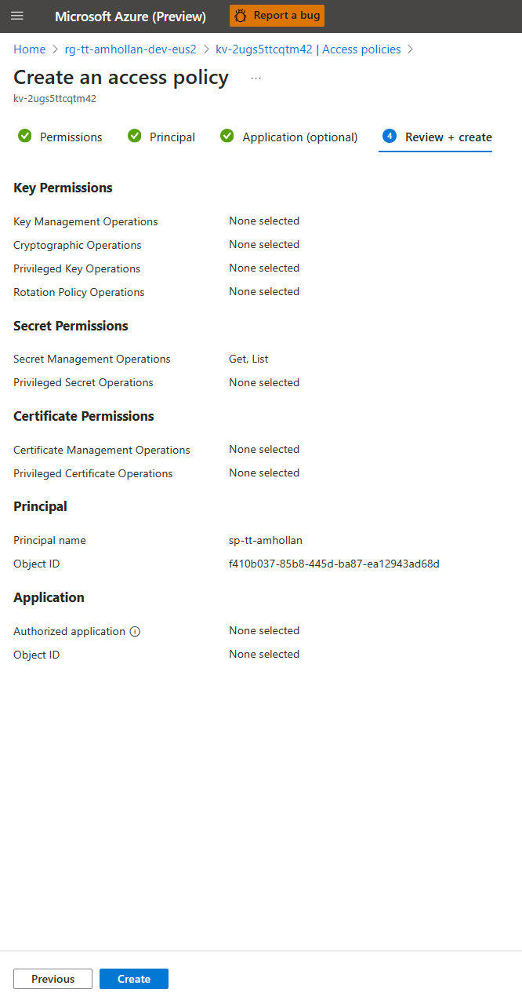
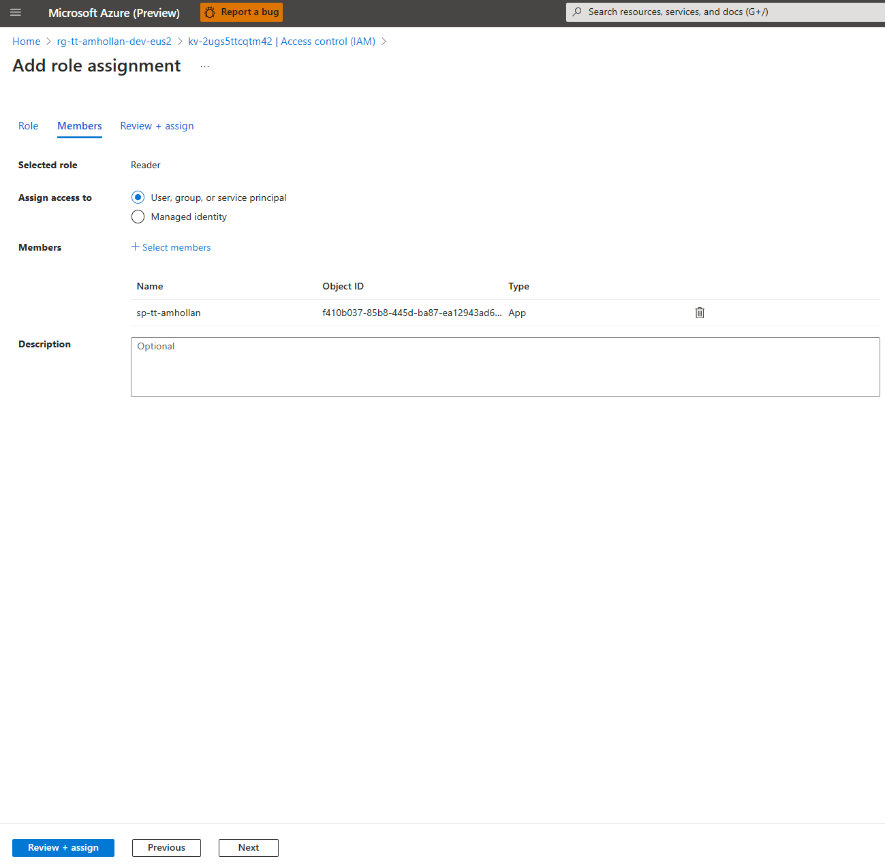
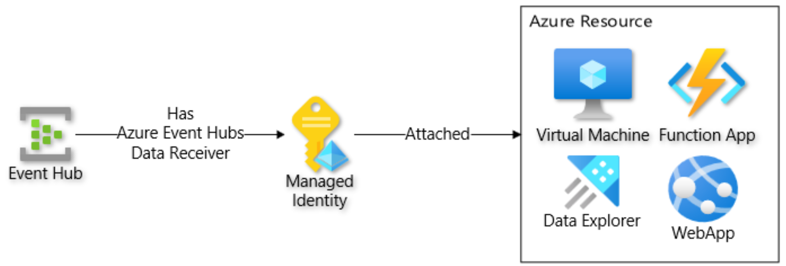

# Workshop: Security Principals

- [Introduction](#introduction)
- [Learning Objectives](#learning-objectives)
- [Challenges](#challenges)
    - [Challenge 1: Use Service Principal to access Azure Key Vault](#challenge-1)
    - [Challenge 2: Use a User-assigned Managed Identity to communicate securely with Azure services](#challenge-2)
- [Additional Resources](#additional-resources)

## Introduction <a name="introduction"></a>
A tenant is an organization or company that has a Microsoft Entra ID (Active Directory) instance associated with it. It's the security and identity backbone for all Azure services. A tenant contains information about a single organization, including organizational objects such as security principals,  devices, and access and compliance policies for resources.



A security principal represents a user, group, service principal or managed identity that is assigned different roles to Microsoft Entra and Azure resources.



Let's recap some of the Azure's core elements:
* **Service principal**: A service principal is a type of security principal that represents a non-human entity, such as an application or a script, that interacts with Azure resources. It uses a secret or a certificate to authenticate, instead of a password.

* **Managed Identity**: A managed identity is a feature that gives an identity to a service or application in Azure, so that it can authenticate with Entra ID and access other resources securely. Azure takes care of creating and managing the identity tokens and credentials for the service or application, so that developers don’t have to.

* **Application Registration**: Application registration is the first step to declare an application in Entra ID. It creates both an identity and an enterprise application for the application, but it mainly defines the application itself.

* **Enterprise Application**: Enterprise application is a configuration container for an application, that includes settings for how it interacts with Entra ID and what permissions it has. It helps to manage the application’s settings and relationships, such as authentication, SSO, and permissions.

    > **How They Relate?** When you enable a managed identity for an Azure resource, such as a VM, App Service, or Azure Function, Azure automatically creates an enterprise application for it in Entra ID. This enterprise application represents the Azure resource and its settings for authentication and authorization. The managed identity is used by the Azure resource to authenticate with Entra ID and access other resources securely. So, in practice, a managed identity is linked to an enterprise application, and they work together to enable secure identity-based access for Azure resources, including applications and services.
    Scope: Scope is a set of resources that are organized in a hierarchical structure, where each level is more specific than the one above it.


* **Role Assignment**: Is the process of attaching a role definition to a user, group, service principal, or managed identity at a particular scope for the purpose of granting access.


## Learning Objectives <a name="learning-objectives"></a>
1. Configure and access Azure Services with Service Principals.
1. Authoring Bicep infrastructure as code.

## Challenges <a name="challenges"></a>
1. Use Service Principal to access Azure Key Vault.
1. Use a User-assigned Managed Identity to communicate securely with Azure services.

### Challenge 1: Use Service Principal to access Azure Key Vault <a name="challenge-1"></a>
1. Create a new Service Principal via Azure Portal:
    1. In the Azure portal, select **Microsoft Entra ID**.
    1. Click **+ Add**, and select **App Registration**.
        
    1. Provide a name for the application, like `sp-tt-<alias>`.
    1. For Supported account types, select **Accounts in this organization directory only**. Leave the other options as is.
    1. Click **Register**.
    1. After registering a new application, you can find the **Application (client) ID**, **Object ID** and **Directory (tenant) ID** from the overview menu option. Make a note of the values for use later.
    1. Click **Certificates & secrets** and then **+ New client secret**.
    1. Provide a description for the secret, select an expiration duration, and click **Add**.
    1. Make a note of the value of the client secret created. You will not be able to retrieve the secret later.
1. Provide your Service Principal data plane access to read secrets from Key Vault via Azure Portal:
    1. Go to the Key Vault you created in the previous workshop.
    1. Select **Access policies** and then **+ Add**.
    1. In **Permissions** tab, under **Secret Management** check **Get** and **List** permission and click **Next**.
    1. In **Principal** tab, search for the Service Principal you created and select it, then click **Next**.
    1. Skip Application (Optional) tab by clicking **Next**.
    1. Review the access policy.
    1. Click **Create**.

        


1. Provide your Service Principal control plane **Reader** access on a Key Vault (this step is only required when authenticate using Service Principal via Azure CLI):
    1. Go to the Key Vault.
    1. Select **Access control (IAM)**, click **+ Add** and then select **Add role assignment**.
    1. In **Role** tab, under **Job function roles** select **Reader** and click **Next**.
    1. In **Members** tab, select **+ Select members**.
    1. Search for the Service Principal you created and select it, then click **Select**.
    1. Click **Next** and review the assignment.
    1. Click **Review + assign**.

        

1. Login to Azure via az cli using a Service Principal:
    ```bash
    applicationId='<applicationId>'
    objectId='<objectId>'
    tenantId='<tenantId>'
    password='<password>'

    az login --service-principal --username $applicationId --password $password --tenant $tenantId
    ```
1. Get the secret value from Key Vault:
    ```bash
    keyVaultName=<yourKeyVaultName> # Can be found in .azure/<environmentName>/.env/AZURE_KEY_VAULT_NAME
    secretName='AZURE-COSMOS-CONNECTION-STRING'

    az keyvault secret show --name $secretName --vault-name $keyVaultName --query value -o tsv
1. Delete access policy and the service principal once you are done:
    ```bash
    subscriptionId=<subscriptionId>

    # Logout from the service principal
    az logout

    # Login with your user account
    az login

    # Remove the Key Vault Access Policy you created earlier for the service principal
    az keyvault delete-policy --name $keyVaultName --object-id $objectId --subscription $subscriptionId

    # Delete service principal (will work from a managed device only, otherwise you will have to use the Azure Portal to delete it)
    az ad sp delete --id $objectId
    ```

### Challenge 2: Use a User-assigned Managed Identity to communicate securely with Azure services <a name="challenge-2"></a>
A common challenge for developers is the management of secrets, credentials, certificates, and keys used to secure communication between services. Managed identities eliminate the need for developers to manage these credentials.

While developers can securely store the secrets in Azure Key Vault, services need a way to access Azure Key Vault. Managed identities provide an automatically managed identity in Microsoft Entra ID for applications to use when connecting to resources that support Microsoft Entra authentication. Applications can use managed identities to obtain Microsoft Entra tokens without having to manage any credentials.

Here are some of the benefits of using managed identities:
* You don't need to manage credentials. Credentials aren’t even accessible to you.
* You can use managed identities to authenticate to any resource that supports Microsoft Entra authentication, including your own applications.
* Managed identities can be used at no extra cost.



Update **infra/main.bicep** file and create a User Managed Identity to securely authenticate between your azure services:
1. Reuse **infra/core/security/user-managed-identity.bicep** Bicep module to deploy a User Managed Identity.
    ```bicep
    module userManagedIdentity './core/security/user-managed-identity.bicep' = {
        name: 'msi-deployment'
        scope: rg
        params: {
            location: location
            name: '${abbrs.managedIdentityUserAssignedIdentities}${resourceToken}'
        }
    }
    ```
1. Reuse **infra/core/messaging/eventhub.bicep**  Bicep module to deploy an Azure Event Hub with a Role Assignment to attach **Azure Event Hubs Data Receiver** role definition to the User Managed Identity you created earlier.
    ```bicep
    module eventHubRequests './core/messaging/eventhub.bicep' = {
        name: 'eventhub-requests-deployment'
        scope: rg
        params: {
            location: location
            workspaceId: monitoring.outputs.logAnalyticsWorkspaceId
            eventHubNamespaceName: '${abbrs.eventHubNamespaces}${resourceToken}'
            eventHubName: '${abbrs.eventHubNamespacesEventHubs}${resourceToken}'
            roleAssignments: [
                {
                    principalType: 'ServicePrincipal'
                    roleDefinitionId: 'a638d3c7-ab3a-418d-83e6-5f17a39d4fde' // Azure Event Hubs Data Receiver
                    principalId: userManagedIdentity.outputs.properties.principalId
                }
            ]
        }
    }
    ```
1. Run the `azd provision` command for provision the cloud resources:

    ```azdeveloper
    azd provision
    ```

    After provisioning the resources, you can find the **Event Hub** and **User Managed Identity** resources in the Azure Portal.
1. Validate that the role assignment has been created in the least privilaged scope, by navigating to the **Role Assignments** tab under the **Access Control (IAM)** menu option of the **Event Hub** resource.

Now any Azure resource that supports Azure Entra authentication and has permissions can use the User Managed Identity to authenticate with this specific Azure Event Hub and consume events from it.

> **Note**: A Role Assignment resource can be created at a particular scope for the purpose of granting least privilage access. In Bicep, to follow the best practice of granting lease privilage access, the role assignment resource should be created in the same module as the resource it is granting access to. For example, the **infra/core/messaging/eventhub.bicep** module is creating the Event Hub resource, so the Role Assignment resource should be created in the same module. It can still be created in a separate module or in the main module by reusing **infra/core/security/role.bicep**, but the scope will be different.


## Additional Resources <a name="additional-resources"></a>
| Name | Description |
| --- | --- |
| [Extensions for Visual Studio Code](https://marketplace.visualstudio.com/vscode) | VSCode extensions marketplace |
| [User Managed Identity API Reference](https://learn.microsoft.com/en-us/azure/templates/microsoft.managedidentity/userassignedidentities?pivots=deployment-language-bicep) | Official Azure Resource Manager API reference for User Managed Identity|