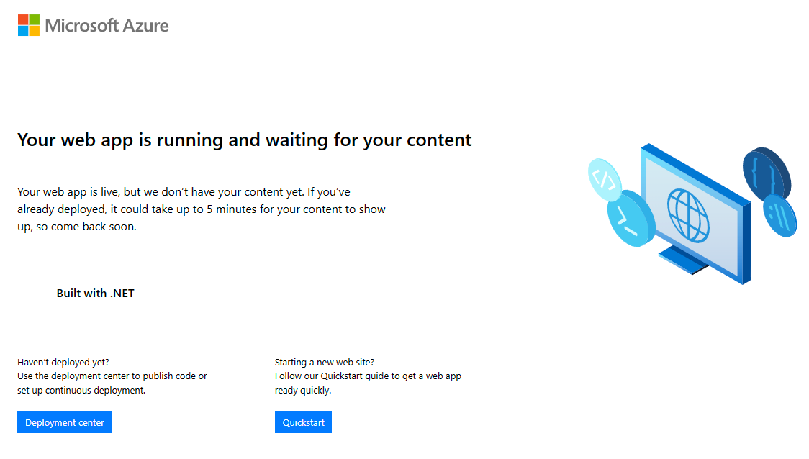

# Workshop: Express V2 (Ev2)

- [Introduction](#introduction)
- [Learning Objectives](#learning-objectives)
- [Challenges](#challenges)
    - [Challenge 1: Authoring Ev2 Service Artifacts](#challenge-1)
    - [Challenge 2: Provision cloud resources using Ev2](#challenge-2)
    - [Challenge 3: Package and Deploy artifcats using ZipDeploy](#challenge-3)
    - [Challenge 4 (<span style="color:green"><b>Optional</b></span>): Configure azd with your new prod environment](#challenge-4)
- [Additional Resources](#additional-resources)

## Introduction <a name="introduction"></a>
Ev2 provides secure, automated solutions for deploying Azure resources in public, sovereign and air-gapped clouds. Ev2 orchestrates resource deployment across regions and scale-units. It includes health checks to catch any potential problems before they are widely deployed. By using Ev2, you can comply with safe deployment practices for Azure.

Ev2 enables internal teams to create declarative, automated deployments of Azure services for all regions and clouds. It uses and extends ARM templates for deploying Azure resources. Ev2 extends ARM templates by providing a global service topology model and gradual rollout of changes.

## Learning Objectives <a name="learning-objectives"></a>
1. Authoring Ev2 infrastructure as code.
1. Get familiar with Ev2 deployments using Ev2 CLI.

## Challenges <a name="challenges"></a>
1. Authoring Ev2 Service Artifacts.
1. Provision cloud resources using Ev2.
1. Package and Deploy artifcats using ZipDeploy.
1. (<span style="color:green"><b>Optional</b></span>): Configure azd with your new prod environment.

### Challenge 1: Authoring Ev2 Service Artifacts <a name="challenge-1"></a>
For this workshop, please decide if you would like to:
1. Use existing Ev2 service artifacts.
1. Create your own Ev2 service artifacts.

<br />

1. Use existing Ev2 service artifacts:
    Locate the existing Ev2 service artifacts under `ev2` folder.

    1. Checkout **ev2** branch using:
        ```bash
        git switch origin/ev2
        ```
    1. Review files under `ev2` folder.
    1. Press `Ctrl` + `P` to search each file in the following table, and replace the parameters:

        | File | Parameter | Description | Notes |
        |---|---|---|---|
        | ConfigurationSpec.Common.json | `<your-alias>` | Replace with your alias, to align Ev2 resources names with the convention used with azd. | |
        | ConfigurationSpec.Dev.json | `<principalId>`   | Replace with your user principal id | Retreive your user object id from Azure Entra ID <br />`az ad signed-in-user show --query id -o tsv` |
        | ConfigurationSpec.Dev.json | `<tenantId>` | The Azure Subscription where your resources will be deployed. | Retreive tenant ids you are a member of, otherwise you can find the tenantId in the Azure Portal via Microsoft Entra ID blade <br /> `az account tenant list --query "[].tenantId"` |
        | ServiceModel.json | `<your-alias>` | Replace with your alias, to align Ev2 resources names with the convention used with azd. | Service Model cannot be parameterized using Configuration files. |
        | ServiceModel.json | `<your-subscription-id>` | Replace with your Subscription Id | |
        | ServiceModel.json | `<region-name>` | The location where you deployed your resources | Find the value in Configuration.Common.json |
        | ServiceModel.json | `<region-short-name>` | The location short name where you deployed your resources. | Find the value in Configuration.Common.json |

    1. Review changes under *main.bicep*.
        > **Note**: Ev2 support any scopeTarget deployment, but for this workshop in order to maintain minimal changes to the existing code, **main.bicep** was updated to use resourceGroup as targetScope.

1. Create your own Ev2 service artifacts:
    1. Create ev2 folder in the root of the repository.
    1. Create **Todo.Deployment.csproj** - A project to prepare the deployment artifacts:
        * Compile Bicep files to ARM Templates.
        * Package dependencies, binaries and artifacts for deployment.
    1. Add project to the sln file, for organize the solution:
        ```bash
        dotnet sln Todo.sln add ev2/Todo.Deployment.csproj
        ```
    1. Author Ev2 service artifacts for multiple environments:
        1. **dev** - Place the RolloutSpec under **ev2/RolloutSpecs/RolloutSpec.Dev.json**.
        1. **prod** - Place the RolloutSpec under **ev2/RolloutSpecs/RolloutSpec.Prod.json**.

    1. Ev2 provision the resource group for you, hence if you try to create a resource group in your **main.bicep** file, you will get an error that claims that the resource group is not declared in this template, you can either declare it as existing and maintain the targetScope as subscription or change the targetScope to resourceGroup and update the file accourdingly.

    > **Note**: azd resource group scope deployment is currently an alpha feature
[see more](https://learn.microsoft.com/en-us/azure/developer/azure-developer-cli/resource-group-scoped-deployments). If you will update main.bicep file to use resourceGroup as targetScope, you will need to enable azd with resource group scope deployment capability.
    1. Update all applications to prepare zip packages for deployment.
    1. Create a deployment artifact `ev2/RolloutSpecs/RolloutSpec.*.Apps.json` using ZipDeploy for your apps.

### Challenge 2: Provision cloud resources using Ev2 <a name="challenge-2"></a>
For Ev2 rollout, we are required to have a compiled ServiceGroupRoot and we will use the Ev2 CLI for provisioning. Ev2 CLI is a multi-platform client for interacting with Ev2 service.
1. Get familiar with **ev2 cli** for Linux:
    1. Go to the repo [here](https://msazure.visualstudio.com/Azure-Express/_git/Quickstart?path=%2FEv2_CLI&version=GBmaster), download Linux operating system.
        
    1. Place the zip file under **/workspaces/techtrain-handson-azure-development/bin**.
    1. Unzip **Linux.zip** file using:
        ```bash
        unzip Linux.zip
        ```
    1. Enter to ev2 cli directory to avoid dependencies issues:
        ```bash
        pushd ./bin/Linux
        ```
1. Provision cloud resources:
    1. Provision your dev environment
        ```bash
        ./ev2 rollout new --waittocomplete --servicegrouproot "/workspaces/techtrain-handson-azure-development/bin/ServiceGroupRoot/" --rolloutspec "RolloutSpecs/RolloutSpec.Dev.json" --rolloutinfra Prod
        ```
    1. Provision your prod environment
        ```bash
        ./ev2 rollout new --waittocomplete --servicegrouproot "/workspaces/techtrain-handson-azure-development/bin/ServiceGroupRoot/" --rolloutspec "RolloutSpecs/RolloutSpec.Prod.json" --rolloutinfra Prod
        ```

    | Parameter | Description |
    |---|---|
    | waittocomplete | Waits for the submitted rollout to complete and provides periodic updates. |
    | servicegrouproot | The root (prefix) that contains all rollout artifacts. |
    | rolloutspec | The name of the rollout specification file to be used in the specified service group root. |
    | rolloutinfra | The name of the target rollout infrastructure to use. See Environment(https://ev2docs.azure.net/getting-started/environments/overview.html) for reference. |
1. Test your new prod functionality using the endpoints from Azure Portal.
    1. Open your prod resource group in Azure Portal
    1. For each site resource, open the url and validate the service is up and running.
    did it worked?

    <table><tr><td valign=top>
    
    </td><td>
    
    </td></tr></table>

 azd was taking care of package and deployment of the applications, but with Ev2 we need to add another steps to the deployment. one possible solution will be leveraging Ev2 file upload feature and use ZipDeploy ARM operation:
    1. Package applications artifacts.
    1. Update site's appsettings with **WEBSITE_RUN_FROM_PACKAGE: 1**.
    1. Add ZipDeploy ARM operation to Bicep in order to deploy the zip file to the App Hosting Plan.

## Challenge 3: Package and Deploy artifcats using ZipDeploy <a name="challenge-3"></a>
1. Deploy applications to prod environment::
    ```bash
    ./ev2 rollout new --waittocomplete --servicegrouproot "/workspaces/techtrain-handson-azure-development/bin/ServiceGroupRoot/" --rolloutspec "RolloutSpecs/RolloutSpec.Apps.Prod.json" --rolloutinfra Prod
    ```
1. Validate the applications are up and running.

### Challenge 4 (<span style="color:green"><b>Optional</b></span>): Configure azd with your new prod environment <a name="challenge-4"></a>
1. Create new azd environment using `azd env`` command:
    ```azdeveloper
    azd env new tt-<alias>-prod-<region-short-name>
    ```
1. Provision cloud resources using `azd provision`, this will sync local state of the resources with the state of the resources in the environment.
1. Validate new environment is fully functional.

The course main branch is still not aligned with ev2 branch please continue with the main branch from now on.


### Additional Resources
| Name | Description |
| --- | --- |
| [Ev2 References](https://ev2docs.azure.net/references/overview.html) | Ev2 REST APIs and CLI/Powershell for Windows or multi-platform clients |
| [Ev2 CLI](https://ev2docs.azure.net/references/cli/intro.html) | A multi-platform client for interacting with Ev2 service |


