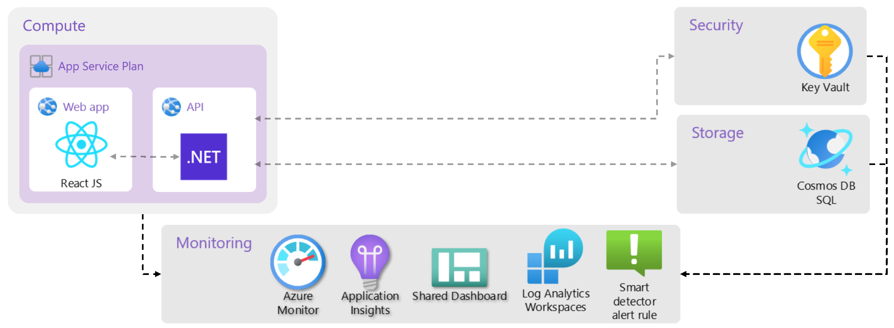
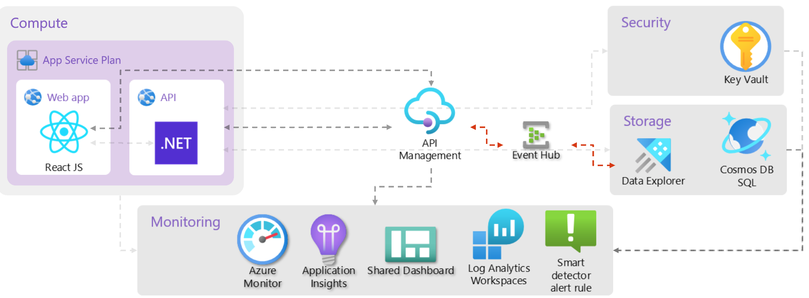

# Workshop: Centralizing control of your APIs securely and at scale

- [Introduction](#introduction)
- [Learning Objectives](#learning-objectives)
- [Challenges](#challenges)
    - [Challenge 1: Use APIM for backend API protection and observability](#challenge-1)
    - [Challenge 2: Configure you APIM to ingest all incoming requests into an Event Hub](#challenge-2)
    - [Challenge 3 (<span style="color:green"><b>Optional</b></span>): Configure a Data Connection between an Event Hub and Analytics Database](#challenge-3)
- [Additional Resources](#additional-resources)

## Introduction <a name="introduction"></a>
If we review current infrastructure we will note that the *Web* service is accessing the *API* service directly, which is not a good practice.
Directly accessing one service from another can have several disadvantages, and this is where the concept of API gateways, like **Azure API Management** (aka APIM), comes into play. Here are some potential disadvantages of services accessing each other directly without an intermediary:
1. **Security Concerns**:
    * **Limited Security Measures**: Direct communication might lack centralized security measures. API gateways provide a centralized point for implementing security protocols, such as authentication, authorization, and encryption.
1. **Lack of Abstraction**:
    * **Hardcoded Endpoints**: If Service A directly accesses Service B, it might have hardcoded endpoints. This makes the system less flexible and more prone to errors when endpoints change.
1. **Scalability Challenges**:
    * **Limited Load Balancing**: Direct communication might struggle with load balancing. An API gateway can distribute incoming requests evenly among multiple instances of a service, ensuring better scalability.
1. **Monitoring and Logging**:
    * **Limited Visibility**: Direct communication may offer limited visibility into the interactions between services. API gateways provide monitoring and logging capabilities, allowing for better insights into API usage, performance, and potential issues.
1. **Versioning Challenges**:
    * **Versioning Issues**: Direct communication can lead to versioning challenges. If Service B undergoes changes, it might break compatibility with Service A. An API gateway can help manage versioning and provide backward compatibility.
1. **Cross-Cutting Concerns**:
    * **Cross-Cutting Functionality**: Direct communication may require duplicating cross-cutting concerns (e.g., logging, error handling) across multiple services. An API gateway centralizes these concerns, reducing duplication and improving maintainability.
1. **Protocol Transformation**:
    * **Protocol Mismatch**: Services may communicate using different protocols. An API gateway can handle protocol transformation, translating requests and responses between services using different communication protocols.
1. **Rate Limiting and Throttling**:
    * **Limited Rate Limiting**: Direct communication might lack effective rate limiting and throttling mechanisms. An API gateway can enforce rate limits to prevent abuse and ensure fair usage of services.
1. **Circuit Breaker Pattern**:
    Lack of Circuit Breaking: In the case of failures or degraded performance, an API gateway can implement the circuit breaker pattern, preventing cascading failures by temporarily halting requests to a failing service.
1.  **Service Discovery**:
    * **Limited Service Discovery**: Direct communication may struggle with service discovery. API gateways can help with service registration and discovery, making it easier for services to locate and communicate with each other.

While direct communication between services is possible, using an API gateway like **Azure API Management** provides a centralized, managed, and configurable solution to address many of the challenges associated with direct service-to-service communication. It enhances security, scalability, monitoring, and overall manageability of the interactions between services in a microservices architecture.

## Learning Objectives <a name="learning-objectives"></a>
1. Utilizing **Azure API Management** for API governance.
1. Authoring Bicep templates to deploy an **Azure API Management**, **Azure Event Hub**, **Azure Data Explorer** services and configure them to work together.


## Challenges <a name="challenges"></a>
* Challenge 1: Use APIM for backend API protection and observability.
    * Deploy **Azure API Management** to your environment.
    * Configure **Azure API Management** to expose the API service.
* Challenge 2: Configure you APIM to ingest all incoming requests into an Event Hub.
* Challenge 3: Configure a Data Connection between an Event Hub and Analytics Database.

<table>
<tr><td><h3>Change this</h3></td><td><h3>Into this</h3></td></tr>
<tr><td>
    
</td><td>

</td></tr>
</table>


### Challenge 1: Use APIM for backend API protection and observability <a name="challenge-1"></a>
The template is already prepared to use APIM for backend API protection and observability.
1. Expose your API service via an APIM:
    1. Go to file using `Ctrl` + `P` and open **main.parameters.json**.
    1. Update **useAPIM** parameter default value to **true**, this will enforce every new environment deployed by the template to use APIM by default.
    1. Enable APIM in your Azure environment, by updating your azd environment
        ```azdeveloper
        azd env set USE_APIM true
        ```
    1. Deploy changes to your environment:

        ```azdeveloper
        azd provision
        ```

        > **Note**: it might take few minutes to deploy the changes.

    <br />

    The frontend will be configured to make API requests through APIM instead of calling the backend directly, so that the following flow gets executed:
    1. APIM receives the frontend request, applies the configured policy to enable CORS, validates content and limits concurrency. Follow this [guide](https://learn.microsoft.com/azure/api-management/api-management-howto-policies) to understand how to customize the policy.
    1. If there are no errors, the request is forwarded to the backend and then the backend response is sent back to the frontend.
    1. APIM emits logs, metrics, and traces for monitoring, reporting, and troubleshooting on every execution. Follow this [guide](https://learn.microsoft.com/azure/api-management/api-management-howto-use-azure-monitor) to visualize, query, and take actions on the metrics or logs coming from APIM.

    > **Note**: the template uses the `Consumption tier` that is a lightweight and serverless version of APIM service, which is ideal for development and testing environments, but has drawbacks like **coldstart**. For production environments, it is recommend using the Premium tier.

### Challenge 2: Configure you APIM to ingest all incoming requests into an Event Hub <a name="challenge-2"></a>
1. Configure an **Azure API Management** logger to send all incoming requests to **Azure Event Hub**.
    1. Create [**Microsoft.ApiManagement/service/loggers**](https://learn.microsoft.com/en-us/azure/templates/microsoft.apimanagement/service/loggers?pivots=deployment-language-bicep) logger resource:
        1. Open **main.bicep** file and populate the Event Hub connection string to apimApi module. Using a connection string is not recommended for production environments, but for this course, instead of configurating APIM to use Managed Identity we will use the connection string and maintain minimal code changes.
        1. Open **apim-api.bicep** file, and create a new **Microsoft.ApiManagement/service/loggers** resource:
        ```bicep
        resource ehLoggerWithConnectionString 'Microsoft.ApiManagement/service/loggers@2022-04-01-preview' = if (!empty(eventhubConnectionString)) {
            name: eventHubLoggerName
            parent: apimService
            properties: {
                loggerType: 'azureEventHub'
                description: 'Event hub logger with connection string'
                credentials: {
                connectionString: eventhubConnectionString
                name: 'ApimEventHub'
                }
            }
        }
        ```
    1. Update APIM API **inbound policy** to log events to Azure Event Hub:
        ```xml
        <log-to-eventhub logger-id="{loggerId}">
            @{
                return new JObject(
                    new JProperty("EventTime", DateTime.UtcNow.ToString()),
                    new JProperty("ServiceName", context.Deployment.ServiceName),
                    new JProperty("RequestId", context.RequestId),
                    new JProperty("RequestIp", context.Request.IpAddress),
                    new JProperty("OperationName", context.Operation.Name)
                ).ToString();
            }
        </log-to-eventhub>
        ```
        and replace `{loggerId}` with the logger name you created in the previous step.

### Challenge 3 (<span style="color:green"><b>Optional</b></span>): Configure a Data Connection between an Event Hub and Analytics Database <a name="challenge-3"></a>
1. Configure you APIM to ingest all incoming requests into an analytics database.
    1. Deploy **Azure Data Explorer**.
    1. Create Azure Data Explorer **Requests** table and a json mapping.
    1. Configure a **Data Connection** from Azure Event Hub to Azure Data Explorer.


### Additional Resources <a name="additional-resources"></a>
| Name | Description |
| --- | --- |
| [Azure Templates Documentation](https://learn.microsoft.com/en-us/azure/templates/) | Azure Infrastrucutre as Code Reference |

