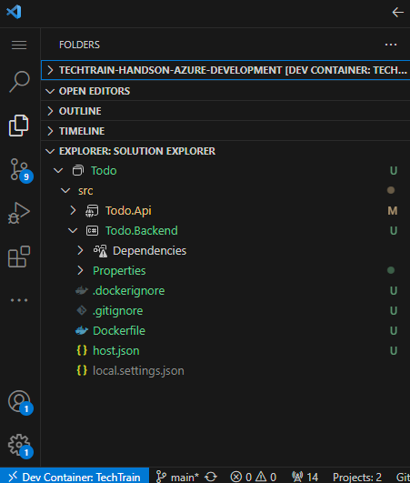
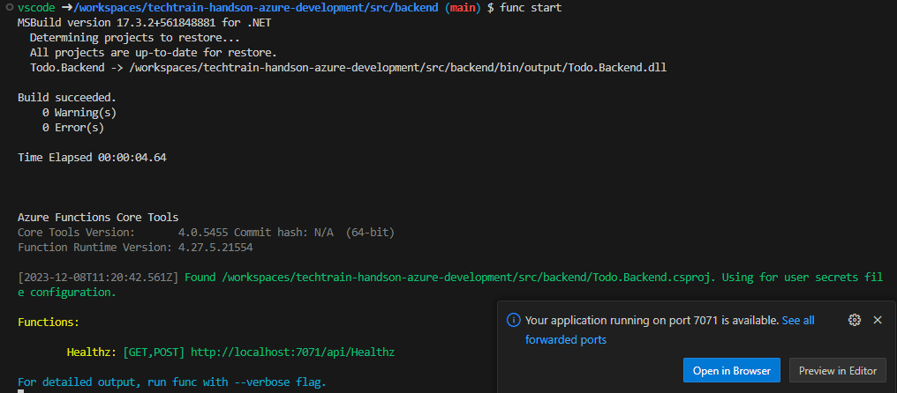
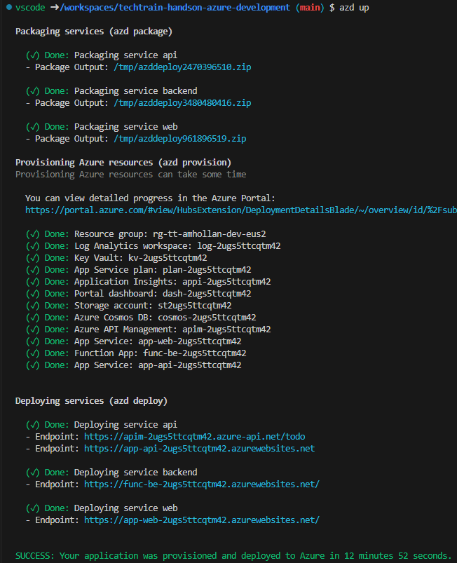
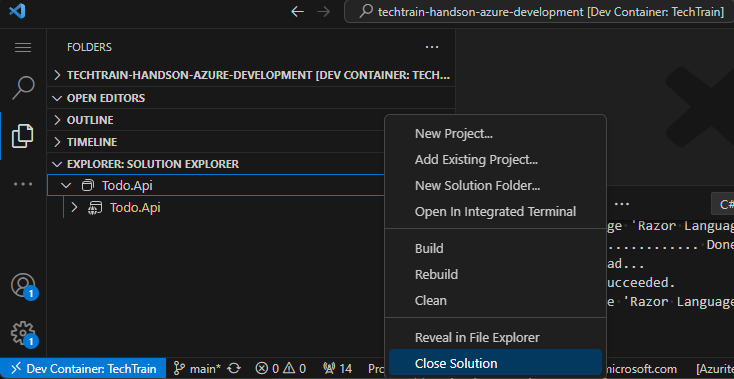

# Workshop: Getting started with Azure Functions

- [Introduction](#introduction)
- [Learning Objectives](#learning-objectives)
- [Challenges](#challenges)
    - [Challenge 1: Create your first containerized Azure Functions project](#challenge-1)
    - [Challenge 2: Deploy Azure Functions application to Azure using Bicep](#challenge-2)
    - [Challenge 3 (<span style="color:green"><b>Optional</b></span>): Organize projects using a Project Solution](#challenge-3)
- [Additional Resources](#additional-resources)

## Introduction <a name="introduction"></a>
Now we are ahead for the next challenge, where we would like get familiar with Azure Functions and how to use them to build serverless applications. We will start by creating a new Azure Functions project, test and debug the a simple application make sure we have full understanding how to develop and enhance them, and then we will use Bicep to deploy the function app to Azure. Once we have it up and running, we will create a project solution file to organize our different projects.

> **Azure Functions Core Tools (func)**: is a command-line tool that lets you develop, manage, and deploy Azure Functions projects from your local computer. You can use Core Tools to create, add, and bind functions to your project, and start the Functions host to run or debug them. You can also use Core Tools to deploy your code to Azure and work with application settings.

## Learning Objectives <a name="learning-objectives"></a>
1. Developing Azure Functions applications.
1. Organizing projects using a Project Solution (.sln).


## Challenges <a name="challenges"></a>
1. Create your first containerized Azure Functions project.
1. Deploy Azure Functions application to Azure using Bicep.
1. (<span style="color:green"><b>Optional</b></span>) Organize projects using a Project Solution


### Challenge 1: Create your first containerized Azure Functions project <a name="challenge-1"></a>
1. Initialize new dotnet Azure Functions project using Azure Functions Core Tools CLI (func).

    ```bash
    func init ./src/backend --worker-runtime dotnet --docker
    ```

    > **Note**: The --docker flag is a command-line option that creates a Dockerfile for a container using a base image that is based on the chosen worker runtime

1. Rename **backend.csproj** to **Todo.Backend.csproj** for naming consistency.
    ```bash
    mv ./src/backend/backend.csproj ./src/backend/Todo.Backend.csproj
    ```

1. Review your new **Todo.Backend** project:
    <table>
    <tr>
    <td valign=top width=60%>
    <ul>
    <li><b>host.json</b> - A metadata file that contains configuration options that affect all functions in an Azure Functions app instance. It is used to manage global settings for your function app, such as function timeouts, logging, and triggers. The file is located in the root directory of your function app and is automatically created when you create a new function app project. You can use the <i>host.json</i> file to configure settings such as the maximum number of concurrent function executions, the default function timeout, and the logging level for your function app </li>
    <li><b>local.settings.json</b> - A configuration file that is used to store app settings and connection strings when you develop and test your Azure Functions project locally. Since this file might contains secrets, it is excluded from source control by default, but we can have it in version control by updating <i>./src/backend/.gitignore</i> following best practices and using with Managed Identities instead.</li>
    </li>
    <li><b>Dockerfile</b> - A text file that contains a set of instructions and commands that are used to build a Docker image. The Dockerfile is used to automate the process of creating a Docker image by specifying the base image, adding layers, and defining the commands that should be run when the image is created. Docker images can be used to run applications in any environment that supports Docker, making them a popular choice for deploying applications to the cloud. </li>
    </ul>
    </td><td>
    
    </td></tr>
    </table>

1. Change to the backend project root directory
    ```bash
    pushd src/backend
    ```

1. Create an HttpTrigger function:
    1. Review different C# available functions templates:
        ```bash
        func templates list --language c#
        ```
    1. Create a new HttpTrigger function
        ```bash
        func new --name "Healthz" --template "HttpTrigger" --authlevel "anonymous"
        ```

        This command will create a new Http Trigger function named `Healthz` with `anonymous` authentication level, which means that the function will be accessible without any authentication, and a default implementation that returns Http Status Code 200.
1. Launch the functions runtime host with your function app locally:
    ```bash
    func start
    ```

    Once the build succedded the function app will start locally and you will be able to click on **Open in browser** button in the toast message or open manually `http://localhost:7071` and see function home page is up and test your new HttpTrigger via the corresponded api endpoint `http://localhost:7071/api/Healthz`

    

1. Stop the functions runtime host by pressing `Ctrl` + `C` in the terminal.

1. (<span style="color:green"><b>Optional</b></span>) Test your containerized function app locally:
    1. Build docker image
        ```bash
        docker build -t techtrainhandsonazuredevelopment/todo/backend:v1.0.0 .
        ```

        > **Note**: This step might take few minutes to complete, as it will download the base image and all the dependencies required to run the function app.
    1. Run your containerized function app locally
        ```bash
        docker run -p 8080:80 techtrainhandsonazuredevelopment/todo/backend:v1.0.0
        ```
    1. Stop the running container by pressing `Ctrl` + `C` in the terminal.

1. Change back to root directory
    ```bash
    popd
    ```

1. Run and debug your function locally:
    1. Add **.vscode** tasks and launch configurations for functions.
        1. Add the following tasks to **.vscode/tasks.json** under `tasks` array:
        ```json
        {
            "label": "Start Backend",
            "type": "dotenv",
            "targetTasks": "Backend Functions Run",
            "file": "${input:dotEnvFilePath}"
        },
        {
            "label": "Clean Backend",
            "command": "dotnet",
            "args": [
                "clean",
                "${workspaceFolder}/src/backend/Todo.Backend.csproj",
                "/property:GenerateFullPaths=true",
                "/consoleloggerparameters:NoSummary"
            ],
            "options": {
                "cwd": "${workspaceFolder}/src/backend/"
            },
            "type": "process",
            "problemMatcher": "$msCompile"
        },
        {
            "label": "Build Backend",
            "command": "dotnet",
            "args": [
                "build",
                "${workspaceFolder}/src/backend/Todo.Backend.csproj",
                "/property:GenerateFullPaths=true",
                "/consoleloggerparameters:NoSummary"
            ],
            "type": "process",
            "dependsOn": "Clean Backend",
            "group": {
                "kind": "build",
                "isDefault": true
            },
            "problemMatcher": "$msCompile"
        },
        {
            "label": "Backend Functions Run",
            "detail": "Helper task--use 'Start Backend' task to ensure environment is set up correctly",
            "type": "func",
            "dependsOn": "Build Backend",
            "command": "host start",
            "options": {
                "cwd": "${workspaceFolder}/src/backend/"
            },
            "presentation": {
                "panel": "dedicated",
            },
            "problemMatcher": [
                "$func-dotnet-watch"
            ]
        }
        ```
    1. In order to attach to a running azure functions process, add the following launch configuration, to **.vscode/launch.json** under **configurations** array:
        ```json
        {
            "name": "Attach to .NET Functions",
            "type": "coreclr",
            "request": "attach",
            "processId": "${command:azureFunctions.pickProcess}"
        }
        ```
    1. Start the function locally using command pallete `Ctrl` + `Shift` + `P` and type **Tasks: Run Task** and select **Start Backend** task.
    1. Place a breakpoint in your **Healthz** function.
    1. Open **Run and Debug** panel using `Ctrl` + `Shift` + `D`, select **Attach to .NET Functions** from the dropdown and then pressing **F5** to start debugging.
    1. Trigger your Healthz function and validate the breakpoint is hit.
    1. Stop debugging by pressing `Shift` + `F5` and stop the function app by pressing `Ctrl` + `C` in the terminal.


### Challenge 2: Deploy Azure Functions application to Azure using Bicep <a name="challenge-2"></a>
We could use different compute services like a Azure Container Instances (ACI) or Azure Kubernetes Service to host our function app, but for this workshop we will use an App Service Plan service.

1. Create **backend.bicep** using **infra/core/host/functions.bicep** module.
    1. Understand functions.bicep - app service plan
    1. backend storage best practices and connection string for multicloud
1. Add new backend service to **main.bicep**.
1. Add new backend service to **azure.yaml** for azd.
1. Deploy changes to your environment using `azd up`.

    
1. Locate your service backend endpoint and test your function app

    ```bash
    azd show | grep "backend" | awk '{print $2 "api/healthz"}'
    ```


### Challenge 3: Organize projects using a Project Solution <a name="challenge-3"></a>
A Project Solution (.sln) file is a solution file that is used to group one or more projects together in Visual Studio and now supported also in VSCode. It is a text-based file that stores metadata about your solution, including the projects that are associated with the solution, the items that are not associated with a particular project, and the build configurations that determine which project configurations to apply in each type of build.

There are several reasons why you might want to use a .sln file for your projects. Here are some of them:
1. Different projects can be developed by different teams, and the solution file can help manage the dependencies between them.
1. The solution file can be used to manage the configuration and deployment settings for all of the projects in the solution.
1. Different projects can have different dependencies, either dependencies to other projects in your solution or dependencies to third-party DLLs, pre/post-build steps and more.

Organize the solution using a Project Solution (.sln):
1. Open new terminal: **Menu** -> **Terminal** -> **New Terminal** (or `Ctrl` + `Shift` + `~`).
1. Create new .sln in the root directory:
    ```bash
    dotnet new sln -n Todo
    ```
1. Add existing .NET projects to sln:
    ```bash
    dotnet sln Todo.sln add src/api/Todo.Api.csproj
    ```
1. Close the opened solution in VSCode Solution Explorer, using one of the following options:
    1. Using Command Palette:
        1. Open the Command Palette using `Ctrl` + `Shift` + `P`.
        1. Type **Close Solution** and select **.NET: Close Solution** from the list.
    1. Using the **Solution Explorer** extension:
        1. Right click on the solution name in the Solution Explorer.
        1. Select **Close Solution**.

        
1. Open the new Todo solution in VSCode Solution Explorer:
    1. Open the Command Palette with `Ctrl` + `Shift` + `P`.
    1. Type **Open Solution** and select **.NET: Open Solution** from the list.
    1. Pick **Todo.sln**.
1. Add backend project to the sln:
    ```bash
    dotnet sln Todo.sln add src/backend/Todo.Backend.csproj
    ```
1. Review the new solution in VSCode Solution Explorer:

    

## Additional Resources
| Name | Description |
| --- | --- |
| [Understanding serverless cold start](https://azure.microsoft.com/en-us/blog/understanding-serverless-cold-start/) | APIM - Consumption tier cold start |

