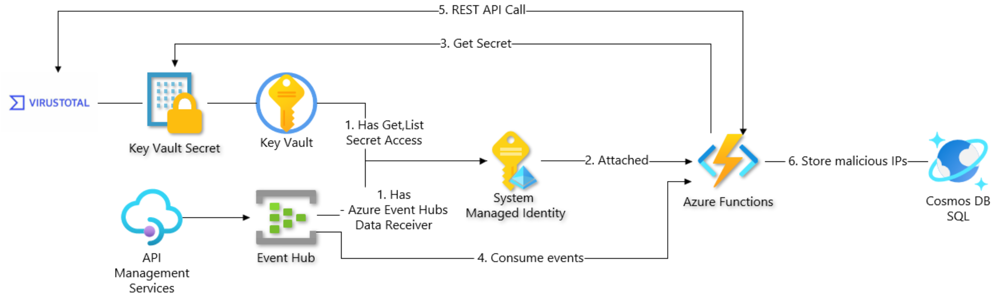
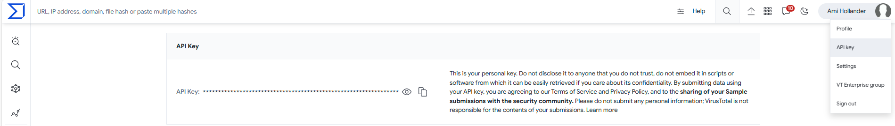

# Workshop: Real-time event streaming for IP threat detection

- [Introduction](#introduction)
- [Learning Objectives](#learning-objectives)
- [Challenges](#challenges)
    - [Challenge 1: Enable DefaultAzureCredential in your function app](#challenge-1)
    - [Challenge 2: Process requests to your application using an EventHubTrigger](#challenge-2)
    - [Challenge 3: Use VirusTotal to detect malicious IP addresses](#challenge-3)
    - [Challenge 4: Store malicious IP addresses reports in Azure Cosmos DB](#challenge-4)
- [Additional Resources](#additional-resources)

## Introduction <a name="introduction"></a>
Malicious IP threat detection is a process of identifying and blocking IP addresses that are involved in malicious activities, such as spamming, phishing, malware distribution, botnet command and control, or denial-of-service attacks. Malicious IP threat detection can help protect networks, systems, and users from cyber threats and improve the security posture of an organization.

VirusTotal is a service that can help you analyze suspicious files, domains, IPs, and URLs to detect malware and other possible security breaches. It can also help you automatically share your threat analysis report with others in the security community. The service is inspecting items with over 70 antivirus scanners and URL/domain blocklisting services, in addition to a myriad of tools to extract signals from the studied content.

In this workshop you will use Azure Functions to create an event streaming pipeline that will consume events from Azure Event Hubs, use VirusTotal to detect malicious IP addresses and store it in Azure Cosmos DB if they are malicious.



To assist you with this workshop, we have provided you with the following supporting files:
- Added the following classes:
    - **VirusTotalClient.cs** - A wrapper class for the VirusTotal API. It uses an HttpClient to send requests to the VirusTotal API and a MemoryCache to cache the results in order to reduce the number of calls to the API.
    - **src/backend/Models/*.cs** - Data Transfer Objects for VirusTotal and Todo application.
- Added NuGet dependencies to **backend.csproj** file:
    - **Microsoft.Extensions.Caching.Memory** - An implementation of the IMemoryCache is a wrapper around the ConcurrentDictionary<TKey,TValue>, exposing a feature-rich API. The in-memory cache solution is great for apps that run on a single server, where all the cached data rents memory in the app's process.
    - **Microsoft.Extensions.Http** - Provides AddHttpClient extension methods for IServiceCollection, IHttpClientFactory interface and its default implementation. This provides the ability to set up named HttpClient configurations in a DI container and later retrieve them via an injected IHttpClientFactoryinstance.
- Configured dependencies in **Startup.cs**:
    ```csharp
    .AddHttpClient()
    .AddMemoryCache()
    ```

Please cherry-pick or checkout the "🧙 supporting files" commit to your local branch.

## Learning Objectives <a name="learning-objectives"></a>
1. Creating an event streaming pipeline with Azure Functions, Azure Event Hubs amd Azure Cosmos DB.
1. Secure access to Azure Key Vault from within a function app using a Managed Identity.
1. Integrate VirusTotal to detect malicious IP addresses.

## Challenges <a name="challenges"></a>
1. Enable DefaultAzureCredential in your function app.
1. Process requests to your application using an EventHubTrigger.
1. Use VirusTotal to detect malicious IP addresses.
1. Store malicious IP addresses reports in Azure Cosmos DB.


### Challenge 1: Enable DefaultAzureCredential in your function app <a name="challenge-1"></a>
DefaultAzureCredential is a class that provides a default authentication flow for applications that will be deployed to Azure. It tries different types of credentials in a certain order, depending on the environment where the application is running. For example, it can use environment variables, managed identities, shared token cache, or interactive browser to obtain an access token from Azure Entra ID. DefaultAzureCredential can help you write cleaner and more secure code, as you don’t need to hardcode or manage your credentials

To authenticate Azure services using a managed identity, first you must grant it access to the Azure services that it needs to access, attach it to the function app, and then DefaultAzureCredentials will be able to authenticate the function app to Azure services using the managed identity.

1. Add **Azure.Identity** NuGet dependency to backend function app, to enable DefaultAzureCredential:
    ```bash
    dotnet add package Azure.Identity --version 1.10.4
    ```
1. Configure **DefaultAzureCredentials** service in *Startup.cs* with `includeInteractiveCredentials: true`:`
    ```csharp
    .AddSingleton<DefaultAzureCredential>(_ => new DefaultAzureCredential(includeInteractiveCredentials: true))
    ```

    > **Note**: `includeInteractiveCredentials: true` will enable interactive login for local development. It is recommended to disable it in production.


### Challenge 2: Process requests to your application using an EventHubTrigger <a name="challenge-2"></a>
1. In **main.bicep** add dedicated consumer group for backend function app in order to consume events from the eventhub without interfering others.
1. Update backend function app with the following configurations, in both **local.settings.json** and **main.bicep**:
    | Parameter | Description |
    |---|---|
    | EventHubRequestsName | The name of the Event Hub that contains the requests to the ToDo application |
    | EventHubRequestsConnectionOptions__fullyQualifiedNamespace | The Event Hub Namespace endpoint. The **__fullyQualifiedNamespace** suffix is used in Managed Identity authentication. |
    | EventHubRequestsConsumerGroup | A unique consumer group you created for this specific application. |
    ```json
    EventHubRequestsName: <eventhub-name>
    EventHubRequestsConnectionOptions__fullyQualifiedNamespace: <eventhub-endpoint>
    EventHubRequestsConsumerGroup: <eventhub-consumer-group>
    ```

    As you can see, we are not using the connection string to connect to the eventhub, but rather the fully qualified namespace. This is because we are using DefaultAzureCredential to authenticate the function app to Azure services using the managed identity. This is a more secure way to authenticate to Azure services, as we don't need to store the connection string in the function app configuration.

1. Create new EventHubTrigger using Azure Functions Core Tools:
    ```bash
    func new --template "EventHubTrigger" --name "EventHubRequestTrigger"
    ```
1. Update new EventHubTrigger with the APIM - Event Hub Requests configurations and extract the IP from the JSON payload.

    **EventHubRequestTrigger.cs**:
    ```csharp
    using System;
    using System.Collections.Generic;
    using System.Linq;
    using System.Text;
    using System.Threading.Tasks;
    using Azure.Messaging.EventHubs;
    using Microsoft.Azure.WebJobs;
    using Microsoft.Extensions.Logging;

    namespace backend
    {
        public static class EventHubRequestTrigger
        {
            [FunctionName("EventHubRequestTrigger")]
            public static async Task Run([
                EventHubTrigger("%EventHubRequestsName%",
                    Connection = "EventHubRequestsConnectionOptions",
                    ConsumerGroup = "%EventHubRequestsConsumerGroup%")] EventData[] events,
                ILogger log)
            {
                var exceptions = new List<Exception>();

                foreach (EventData eventData in events)
                {
                    try
                    {
                        var request = JObject.Parse(eventData.EventBody.ToString());

                        if (!request.TryGetValue("RequestIp", out JToken requestIp))
                        {
                            throw new Exception("Failed to get an IP");
                        }

                        string ip = requestIp.ToString();
                        log.LogInformation($"RequestIp=[{ip}]");

                        // Implement your logic here
                    }
                    catch (Exception e)
                    {
                        // We need to keep processing the rest of the batch - capture this exception and continue.
                        // Also, consider capturing details of the message that failed processing so it can be processed again later.
                        exceptions.Add(e);
                    }
                }

                // Once processing of the batch is complete, if any messages in the batch failed processing throw an exception so that there is a record of the failure.

                if (exceptions.Count > 1)
                    throw new AggregateException(exceptions);

                if (exceptions.Count == 1)
                    throw exceptions.Single();
            }
        }
    }
    ```

    The following implementation is an example of how to configure EventHubTrigger to consume batches of events from the eventhub. The function will process each event in the batch and log the IP address to the console.

1. Run and test function locally by simulating requests to the APIM.

### Challenge 3: Use VirusTotal to detect malicious IP addresses <a name="challenge-3"></a>
To integrate your application with VirusTotal, first you will require to have a VirusTotal API Key and secure it:

1. Create a free VirusTotal account in https://www.virustotal.com/gui/join-us.
1. Locate your Virus Total API Key under your profile and copy it.
    
1. Place the API Key in the key vault:
    ```bash
    # Set the following variables
    keyVaultName=<your-key-vault-name> # Can be found in .env/AZURE_KEY_VAULT_NAME
    secretName="VIRUSTOTAL-API-KEY"
    virusTotalApiKey=<yourVirusTotalApiKey>

    # Retrieve your user object id from Azure Entra ID
    objectId=$(az ad signed-in-user show --query id -o tsv)

    # Create a Key Vault Access Policy with secret set permissions
    az keyvault set-policy --name $keyVaultName --secret-permissions set --object-id $objectId

    # Create new secret in the keyvault
    az keyvault secret set --vault-name $keyVaultName --name $secretName --value $virusTotalApiKey

    # Remove the Key Vault Access Policy you created earlier
    az keyvault delete-policy --name $keyVaultName --object-id $objectId
    ```

1. Add your Azure Key Vault endpoint to **local.settings.json** and **main.bicep**:
    ```json
    KeyVaultEndpoint: <keyvaultEndpoint>
    ```
1. Add NuGet dependency for reading Azure Key Vault secrets:
    ```bash
    dotnet add package Azure.Security.KeyVault.Secrets --version 4.5.0
    ```
1. In **Startup.cs** file, Initialize **VirusTotalClient** using the API Key from your Azure Key Vault and DefaultAzureCredentials.
    ```csharp
    .AddSingleton<VirusTotalClient>(serviceProvider =>
    {
        var keyVaultUri = new Uri(Environment.GetEnvironmentVariable("KeyVaultEndpoint"));
        var httpClient = serviceProvider.GetService<HttpClient>();
        var defaultAzureCredentials = serviceProvider.GetService<DefaultAzureCredential>();

        // Retrieve apiKey from KeyVault
        var secretClient = new SecretClient(keyVaultUri, defaultAzureCredentials);
        var azureResponseKeyVaultSecret = new Lazy<Task<Azure.Response<KeyVaultSecret>>>(async () => await secretClient.GetSecretAsync("VIRUSTOTAL-API-KEY"));
        var virusTotalApiKey = azureResponseKeyVaultSecret.Value.Result.Value.Value;

        IMemoryCache memoryCache = serviceProvider.GetRequiredService<IMemoryCache>();

        return new VirusTotalClient(virusTotalApiKey, httpClient, memoryCache);
    })
    ```

    In runtime, once a function will be injected with the VirusTotalClient, the application will consume the VirusTotal API Key from the Azure Key Vault and will use it to authenticate to VirusTotal API.

    > Note: Since the application will have now a dependency on the Azure Key Vault and VirusTotal services, it will be wise to asses both are healthy while the application is running. You can leverage Healthz endpoint for that.
1. Update the EventHubTrigger function to use VirusTotalClient for assesing every IP received from the Event Hub:
    ```csharp
    namespace backend
    {
        public class EventHubRequestTrigger
        {
        private readonly VirusTotalClient _virusTotalClient;

        public EventHubRequestTrigger(VirusTotalClient virusTotalClient)
        {
            _virusTotalClient = virusTotalClient;
        }

        private static bool IsMaliciousIp(JObject ipReport)
        {
            return ipReport["data"]["attributes"]["last_analysis_stats"]
                .ToObject<Dictionary<string, int>>()
                .Where(kvp => kvp.Key != "undetected")
                .Sum(kvp => kvp.Value) > 0;
        }

        ...

        // For every IP received from the eventhub, check if it is malicious and print the result to the console.
        JObject ipReport = await _virusTotalClient.GetIPReportAsync(ip);
        bool isMalicious =  IsMaliciousIp(ipReport);

        log.LogInformation($"IP=[{ip}], isMalicious=[{isMalicious}]");

        ...
    ```
1. In order to run the functions locally grant yourself with Secrets Get permission on the Azure Key Vault:
    ```bash
    # Set the following variables
    keyVaultName=<your-key-vault-name> # Can be found in .env/AZURE_KEY_VAULT_NAME

    # Retrieve your user object id from Azure Entra ID
    objectId=$(az ad signed-in-user show --query id -o tsv)

    # Create a Key Vault Access Policy with secret set permissions
    az keyvault set-policy --name $keyVaultName --secret-permissions get --object-id $objectId
    ```

    > Note: since this permission is not part of the IaC, you will need to grant yourself with this permission every time after a deployment in order to run the function locally.

1. Run locally your backend application and validate if your IP is malicious, result will be written to console request will be streamed from the Event Hub.


### Challenge 4: Store malicious IP addresses reports in Azure Cosmos DB <a name="challenge-4"></a>
Now that every IP received from the Event Hub is being checked for malicious activity, we would like to store the malicious IP addresses in Azure Cosmos DB.

1. Create new Cosmos DB container for storing VirusTotal reports for malicious IP addresses:
    1. Go to **db.bicep** file and add a new container:
        ```bicep
        {
            name: 'VirusTotal'
            id: 'VirusTotal'
            partitionKey: '/id'
        }
        ```
    1. Provision cloud resources using `azd provision` command:
        ```azdeveloper
        azd provision
        ```

1. Add the following configurations to **local.settings.json** and **main.bicep**:
    ```json
    CosmosDatabaseName: Todo
    CosmosConnectionOptions__accountEndpoint: <cosmos-db-endpoint>
    ```
1. Add NuGet dependency for Azure Cosmos DB bindings:
    ```bash
    dotnet add package Microsoft.Azure.WebJobs.Extensions.CosmosDB --version 4.3.0
    ```
1. Update **EventHubRequestTrigger.cs** to output VirusTotal models for malicious IP addresses to Azure Cosmos DB:
    ```csharp
    // Add output binding to function
    [CosmosDB(
        databaseName: "%CosmosDatabaseName%",
        containerName: "VirusTotal",
        Connection = "CosmosConnectionOptions")]
        IAsyncCollector<VirusTotal> virusTotalEvents,

    ...

    // Output malicious IP addresses report to Cosmos DB
    if (isMalicious)
    {
        await virusTotalEvents.AddAsync(new VirusTotal(ip, ipReport));
    }
    ``````
1. It will be difficult to test this scenario if your IP address is not malicious. Twick the condition you created run the function and validate results are written to Cosmos DB, then revert the condition back to the original state.

# Troubleshooting
* Functions not working as expected? try to change the log level to verbose:
    ```json
    {
        "logging": {
            "logLevel": {
                "default": "Information"
            }
        }
    }
    ```

# Additional resource
| Name | Description |
| --- | --- |
| Use dependency injection in .NET Azure Functions  | https://learn.microsoft.com/en-us/azure/azure-functions/functions-dotnet-dependency-injection |
| Monitor the health of App Service instances - Azure App Service | https://learn.microsoft.com/en-us/azure/app-service/monitor-instances-health-check?tabs=dotnet#enable-health-check